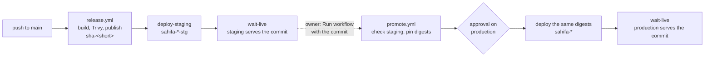

# Deploying on CapRover

CapRover already provides the reverse proxy, TLS and container scheduling, so the compose
bundle is not used there (its Caddy would fight CapRover's nginx for ports 80/443). Instead,
three CapRover apps run the published images; CapRover's nginx terminates TLS and asks for the
basic-auth password, and the web app's Caddy proxies `/api` to the API app over the internal
network. The API reads the sources it assesses with a read-only login.

```
Internet ──▶ CapRover nginx (TLS, basic auth) ──▶ sahifa-web (Caddy :80) ──/api──▶ sahifa-api (:8000) ──▶ sahifa-db
```

## Checklist for the owner (first deploy)

Sahifa has no install yet, so the first deploy is a clean setup of staging on the current
server. Production follows later (section 5, "Production, later").

1. **DNS:** an `A` record `sahifa-stg.siralabs.org` → the staging server (the current
   CapRover server).
2. **Apps** on the staging server, as in sections 1, 2 and 4 with the `-stg` names and the
   staging column of the table below: `sahifa-db-stg` (Has Persistent Data), `sahifa-api-stg`
   (Has Persistent Data), `sahifa-web-stg` with the domain `sahifa-stg.siralabs.org`,
   Enable HTTPS and Force HTTPS.
3. **Basic auth** on `sahifa-web-stg` (HTTP Settings → *Password protect*), then
   `SAHIFA_ACCESS_GATE=basic-auth-at-proxy` on `sahifa-api-stg` (section 4a). Without it the
   api refuses to start.
4. **App tokens:** Deployment tab → **Enable App Token** on `sahifa-api-stg` and
   `sahifa-web-stg`; copy both.
5. **GitHub environment `staging`** with the variables and secrets of section 5, "GitHub
   settings": `CAPROVER_SERVER`, `CAPROVER_WEB_URL`, `CAPROVER_APP_API=sahifa-api-stg`,
   `CAPROVER_APP_WEB=sahifa-web-stg`, `CAPROVER_APP_WORKER=sahifa-worker-stg`, the secrets
   `CAPROVER_APP_TOKEN_API`, `CAPROVER_APP_TOKEN_WEB` and `CAPROVER_WEB_BASIC_AUTH`.
6. **First push to `main`.** `release.yml` builds, scans and publishes the images and deploys
   them to the two `-stg` apps.
7. **Verify:** `GET https://sahifa-stg.siralabs.org/api/version` (after the basic-auth prompt)
   shows the commit of that push, and the release run's last step says
   `web and api run <commit>`.

Optional, any time after: connect a test database to assess (section 6).

## Staging and production (ADR-0012)

Two independent CapRover servers at Hetzner, shared with the other Sīra Labs products:

| Server | Apps | Domain | Data |
|---|---|---|---|
| **Staging and tools** (the current server) | `sahifa-db-stg`, `sahifa-api-stg`, `sahifa-web-stg`, later `sahifa-worker-stg` | `sahifa-stg.siralabs.org` | test data only |
| **Production** (server in Germany) | `sahifa-db`, `sahifa-api`, `sahifa-web`, later `sahifa-worker` | `sahifa.siralabs.org` | real people's data, and only there |

Sections 1–4 below describe one server's apps with the production names. On staging every app
name gets the `-stg` suffix, and so does every internal address and label that names an app:

| Setting | Production | Staging |
|---|---|---|
| `SAHIFA_DATABASE_URL` (and `SAHIFA_MIGRATION_DATABASE_URL`) host | `srv-captain--sahifa-db` | `srv-captain--sahifa-db-stg` |
| `SAHIFA_API_UPSTREAM` (web app) | `srv-captain--sahifa-api:8000` | `srv-captain--sahifa-api-stg:8000` |
| `SAHIFA_PUBLIC_URL` (api app) | `https://sahifa.siralabs.org` | `https://sahifa-stg.siralabs.org` |
| Persistent directory label of the db | `sahifa-pgdata` | `sahifa-stg-pgdata` |
| Persistent directory label of the api | `sahifa-data` | `sahifa-stg-data` |
| `CAPROVER_APP_API`, `_WEB`, `_WORKER` on the GitHub environment | unset (defaults `sahifa-api`, `sahifa-web`, `sahifa-worker`) | `sahifa-api-stg`, `sahifa-web-stg`, `sahifa-worker-stg` |

A staging app that keeps an unsuffixed address talks to nothing, or, once production apps
share a server with it, to the wrong ones. CapRover cannot rename an app: its name is also its
internal address, so choose the name when creating it.

Rules:

- Personal data of real people lives only on production. Staging connects only to test
  databases and takes only test uploads; nothing is copied across.
- Staging and production have separate secrets: database passwords, basic-auth passwords,
  source logins and CapRover app tokens.
- `main` deploys to staging automatically; production runs the image digest staging runs,
  after the owner approves it (section 5).
- Production Postgres is backed up continuously (section 8); restore drills go into a
  throwaway database on the production server, never into staging.

## 1. Database app: `sahifa-db`

- Create a plain app named `sahifa-db` with **Has Persistent Data** ticked (not a One-Click
  App: the plain app keeps the image and its version under our control).
- Deployment tab → *Deploy via ImageName*: `postgres:17`
- App Configs:
  - Environment variables: `POSTGRES_USER=sahifa`, `POSTGRES_PASSWORD=<generated>`,
    `POSTGRES_DB=sahifa`. Generate the password with `openssl rand -hex 24`: hex is safe
    inside the database URL, while base64 may contain `/` or `+`.
  - Persistent directory: path in app `/var/lib/postgresql/data`, label `sahifa-pgdata`
  - Do not map a host port; the API reaches it as `srv-captain--sahifa-db:5432`.
- Check before the first real data: App Configs must show the persistent directory above.
  Without it the data lives in the container and a restart (any Save & Update) starts an
  empty database. CapRover cannot add persistent data to an existing app: delete and
  recreate it with the box ticked.
- `POSTGRES_USER`, `POSTGRES_PASSWORD` and `POSTGRES_DB` only apply when the data directory
  is created. Changing them later changes nothing in the database (the owner keeps its
  password), so leave them as they were; to change a password, `ALTER ROLE` in `psql`.
- `postgres:17` stays on major version 17; a major upgrade needs `pg_upgrade` or a dump and
  restore, never just a new tag.

## 2. API app: `sahifa-api`

- Create app `sahifa-api` with **Has Persistent Data** ticked (for uploads).
- App Configs:
  - Environment variables:

    | Name | Value |
    |---|---|
    | `SAHIFA_ENV` | `prod` |
    | `SAHIFA_DATABASE_URL` | `postgresql+psycopg://sahifa:<password>@srv-captain--sahifa-db:5432/sahifa` |
    | `SAHIFA_MIGRATION_DATABASE_URL` | optional; an owner login for the migration step only. Defaults to `SAHIFA_DATABASE_URL` |
    | `SAHIFA_DATA_DIR` | `/data` (the image default; uploads go to `/data/uploads`) |
    | `SAHIFA_PUBLIC_URL` | the web app's address: `https://sahifa-stg.siralabs.org` on staging, `https://sahifa.siralabs.org` on production |
    | `SAHIFA_ACCESS_GATE` | `basic-auth-at-proxy`, **only after** basic auth is on for the web app (section 4a) |
    | `SAHIFA_CONN_<NAME>` | one per database to assess (section 6) |

    Optional, with their defaults:

    | Name | Default | Meaning |
    |---|---|---|
    | `SAHIFA_SAMPLE_ROWS` | `100000` | rows per table or file the profile and checks see; `0` reads everything |
    | `SAHIFA_MAX_UPLOAD_MB` | `200` | per upload |
    | `SAHIFA_MAX_UPLOAD_FILES` | `20` | per upload |
    | `SAHIFA_UPLOAD_TTL_DAYS` | `7` | uploaded files are deleted after this |
    | `SAHIFA_MAX_CONCURRENT_SCANS` | `2` | scans the api runs at once (ADR-0009) |
    | `SAHIFA_DUCKDB_MEMORY` | `1GB` | DuckDB's memory limit per scan |
    | `SAHIFA_STATEMENT_TIMEOUT_S` | `60` | per statement against a source |
    | `SAHIFA_LOG_LEVEL` | `info` | |

    With `SAHIFA_ENV=prod` the api refuses to start without `SAHIFA_ACCESS_GATE` (ADR-0010:
    there is no sign-in until R2, so an unprotected install must be a deliberate choice) and
    with a placeholder password in `SAHIFA_DATABASE_URL` or any `SAHIFA_CONN_*`. Staging runs
    `prod` too.

  - The image runs the schema migration on every start before serving, so a redeploy
    upgrades the database in place; the app log shows the revision and `GET /api/version`
    reports it as `schema_revision`.
  - Persistent directory: `/data`, label `sahifa-data`. Uploads are disposable (deleted after
    `SAHIFA_UPLOAD_TTL_DAYS`), but without the directory a restart loses the files of scans
    still queued.
  - Container HTTP port: `8000`
  - Memory: until the worker arrives scans run inside the api, so give the container at least
    `SAHIFA_DUCKDB_MEMORY` × `SAHIFA_MAX_CONCURRENT_SCANS` plus 512 MB.
- HTTP Settings: no public domain. Tick **Do not expose as web-app**, so the API is reachable
  only through the web app and its password; the web app reaches it as
  `srv-captain--sahifa-api:8000` either way.
- Deployment tab → **Enable App Token**, copy it (used by CI below). For the first deploy,
  *Deploy via ImageName*: `ghcr.io/sira-labs/sahifa-api:latest`, or leave it to the first
  push to `main`.

## 3. Worker app: `sahifa-worker` (later, R1 sprint 2)

Until spec 007 the api runs scans in a background thread and there is no worker app; skip
this section. From sprint 2 scans run in a Procrastinate worker on the same Postgres
(ADR-0009). Create app `sahifa-worker` then, with the api image and one extra variable:

| Name | Value |
|---|---|
| `SAHIFA_ROLE` | `worker` |
| the api variables | identical to the api app (`SAHIFA_ENV`, `SAHIFA_DATABASE_URL`, every `SAHIFA_CONN_*`, the limits); the worker never needs `SAHIFA_MIGRATION_DATABASE_URL` |

- Has Persistent Data with `/data` as on the api, if uploads stay on a volume; spec 007
  decides whether both share a bucket instead.
- No HTTP settings: the worker serves nothing. Tick **Do not expose as web-app**.
- Deployment tab → **Enable App Token**, copy it into the GitHub secret
  `CAPROVER_APP_TOKEN_WORKER` of the environment. The workflows deploy the worker only when
  that secret exists, so nothing breaks before the app is created. First deploy via
  ImageName: `ghcr.io/sira-labs/sahifa-api:latest`.
- The worker names its database connections `sahifa-worker/<commit>`; `GET /healthz` on the
  api lists them in its `workers` field, and the deploy workflows wait for the new commit
  there.

## 4. Web app: `sahifa-web`

- Create app `sahifa-web` (no persistent data).
- App Configs → Environment variables: `SAHIFA_API_UPSTREAM=srv-captain--sahifa-api:8000`
  (Caddy inside the image proxies `/api` and `/healthz` there; `SAHIFA_DOMAIN` stays unset so
  Caddy serves plain HTTP on :80 behind CapRover).
- Container HTTP port: `80`.
- HTTP Settings: connect the domain (`sahifa.siralabs.org`, on staging
  `sahifa-stg.siralabs.org`), Enable HTTPS, Force HTTPS.
- Deployment tab → **Enable App Token**, copy it. First deploy via ImageName:
  `ghcr.io/sira-labs/sahifa-web:latest`, or leave it to the first push to `main`.

Open the domain: after the password prompt the page shows the API version and lets you
upload a file.

## 4a. Access gate: HTTP basic auth (until sign-in in R2)

Sign-in through a Keycloak realm arrives in R2 (ADR-0010). Until then the web app is the only
public entrance, and CapRover's nginx asks for a password in front of it:

1. `sahifa-web` → HTTP Settings → **Password protect**: a user name (e.g. `sira`) and a
   generated password (`openssl rand -base64 24`). Save. The domain now answers `401` without
   the password, on every path including `/api/version`.
2. Keep the API and the worker off the internet: **Do not expose as web-app** on both
   (sections 2 and 3). Otherwise CapRover's default address of the API would bypass the
   password.
3. `sahifa-api` → App Configs: `SAHIFA_ACCESS_GATE=basic-auth-at-proxy` → Save & Update. The
   api starts; it refuses to start in prod without this setting.
4. Put `user:password` into the GitHub secret `CAPROVER_WEB_BASIC_AUTH` of the same
   environment, so the deploy workflows can check the version behind the prompt.
5. Share the password only with the people who test staging (or use production), through the
   password manager. Staging and production have different passwords.

Set the variable only after step 1: it records that the gate exists, it does not create it.

## 5. Continuous deployment: staging, then promotion to production

Two workflows (ADR-0012):

- **`release.yml`**: every push to `main` (and every `v*` tag on a commit on `main`) builds,
  scans and publishes the images, then its `deploy-staging` job deploys them to the `-stg`
  apps and waits until staging serves the commit.
- **`promote.yml`**: Actions → promote → Run workflow on `main`, with the commit staging
  serves (`GET https://sahifa-stg.siralabs.org/api/version` → `commit`). It checks that the
  commit is on `main` and live on staging (web and api, and the worker once staging has one),
  pins the images to their digests, waits for the owner's approval on the `production`
  environment, deploys those digests (`tag@sha256:…`) to the production apps and waits until
  production serves the commit.



`sha-<short>` tags are immutable: a re-run of `release.yml` for the same commit leaves them
on the digest staging got, and runs for the same commit are serialised so two cannot create
the tag at once. Promotion resolves that tag to digests and deploys by digest, on CapRover
(`tag@sha256:…`) and on a compose host (`SAHIFA_API_IMAGE`, `SAHIFA_WEB_IMAGE`).

Both wait-until-live checks are `.github/scripts/wait-live.sh`, and both fail when their
environment has no `CAPROVER_WEB_URL`: CapRover accepts a deploy before it pulls the image, so
without the check a failed pull or a container that never starts would leave the run green.
It polls `<url>/version.json` (web image) and `<url>/api/version` (api image) for the commit,
sending `CAPROVER_WEB_BASIC_AUTH` past the password prompt, and, once a worker app exists,
waits until `<url>/healthz` lists a connected worker on that commit (the worker names its
database connections `sahifa-worker/<commit>`). That shows a worker on the commit is
connected, not that the old one has stopped.

### GitHub settings (owner, once)

Settings → Environments:

| Environment | Deployment branches and tags | Protection | Variables | Secrets |
|---|---|---|---|---|
| `staging` | Selected: branch `main`, tag pattern `v*` | none | `CAPROVER_SERVER` (the current server's `https://captain.…`), `CAPROVER_WEB_URL=https://sahifa-stg.siralabs.org`, `CAPROVER_APP_API=sahifa-api-stg`, `CAPROVER_APP_WEB=sahifa-web-stg`, `CAPROVER_APP_WORKER=sahifa-worker-stg` | `CAPROVER_APP_TOKEN_API`, `CAPROVER_APP_TOKEN_WEB` of the staging apps (`CAPROVER_APP_TOKEN_WORKER` from sprint 2); `CAPROVER_WEB_BASIC_AUTH` (`user:password` of section 4a) |
| `production` | Selected: branch `main` | Required reviewer: the owner; prevent self-review off | `CAPROVER_SERVER` (the production server), `CAPROVER_WEB_URL=https://sahifa.siralabs.org`; the `CAPROVER_APP_*` variables stay unset (defaults `sahifa-api`, `sahifa-web`, `sahifa-worker`); for a compose host instead: `DEPLOY_HOST`, `DEPLOY_USER` | `CAPROVER_APP_TOKEN_API`, `_WEB` (and `_WORKER` from sprint 2) of the production apps; `CAPROVER_WEB_BASIC_AUTH`; `DEPLOY_SSH_KEY` for a compose host |

Do not create repository-level `CAPROVER_*` variables or secrets (Settings → Secrets and
variables → Actions): repository values reach every job, environment values only the jobs
that bind the environment and pass its rules. The rules hold even if a branch edits a
workflow file: a job that names `production` from any branch other than `main` is refused
before it sees a secret.

Until `CAPROVER_SERVER` is set on `staging`, the `deploy-staging` job is a no-op with a
notice, so CI and image publishing work before CapRover is ready.

Release tags: import `.github/rulesets/protect-release-tags.json` (CONTRIBUTING.md,
"Repository settings") so that only organisation admins can create, move or delete `v*`
tags.

### First setup (owner)

There is no earlier install to move, so the setup is clean and in this order:

1. **Staging.** Point `sahifa-stg.siralabs.org` at the current server, create
   `sahifa-db-stg`, `sahifa-api-stg` and `sahifa-web-stg` as in sections 1, 2 and 4 with the
   staging column of the table in "Staging and production", and set up the access gate
   (section 4a).
2. **GitHub environments.** Create `staging` as in the table above. Create `production` too,
   with its required reviewer and branch rule, but leave its variables and secrets empty
   until step 4: promote.yml stops at its gate with an error until then.
3. **First deploy.** Push to `main` (or re-run the latest `release` run). Check
   `GET https://sahifa-stg.siralabs.org/api/version`.
4. **Production, later.** Once the owner has ordered (or chosen) the production server:
   install CapRover there (strong dashboard password, 2FA, SSH by key only, firewall open
   for 80, 443 and 22), point `sahifa.siralabs.org` at it, create `sahifa-db`, `sahifa-api`
   and `sahifa-web` with production secrets and the production column, set up the access
   gate with its own password, fill in the `production` environment, set up backups
   (section 8), and run promote.yml for the commit staging runs. Check `GET /api/version`
   on the public domain.

Images are public on GHCR, so neither server needs registry credentials; if the repository
ever becomes private, add the registry under CapRover → Cluster → Docker Registries first.

## 6. Connect a database to assess

Sahifa reads sources only, and stores only the name of the variable that holds the
credentials (ADR-0006). For each Postgres database:

1. **A read-only login on the source.** As an owner or admin of that database, with a
   password from `openssl rand -hex 24` (hex, because it sits in a URL):

   ```sql
   CREATE ROLE sahifa_reader LOGIN PASSWORD '<generated>';
   GRANT CONNECT ON DATABASE <db> TO sahifa_reader;

   -- for every schema Sahifa should assess (here: public and sales)
   GRANT USAGE ON SCHEMA public, sales TO sahifa_reader;
   GRANT SELECT ON ALL TABLES IN SCHEMA public, sales TO sahifa_reader;
   -- tables the owning role creates later become readable too
   ALTER DEFAULT PRIVILEGES FOR ROLE <owner role> IN SCHEMA public, sales
     GRANT SELECT ON TABLES TO sahifa_reader;

   -- optional: table and index statistics for the store-health items
   GRANT pg_read_all_stats TO sahifa_reader;
   ```

   No `INSERT`, `UPDATE`, `DELETE`, `TRUNCATE` or `CREATE`. Sahifa additionally opens every
   session as a read-only transaction with a statement timeout
   (`SAHIFA_STATEMENT_TIMEOUT_S`, 60 s), a lock timeout (2 s) and the application name
   `sahifa/<scan id>`, so a scan cannot write, cannot wait on a lock for long, and shows up
   in the source's `pg_stat_activity`. The grants are the first line of defence; the session
   settings are the second.
2. **Network.** The source must accept connections from the CapRover server: another app on
   the same server is `srv-captain--<app>:5432`; a database elsewhere needs its firewall and
   `pg_hba.conf` opened for the server's IP only, and TLS (add `sslmode=require`, or
   `verify-full` with a proper certificate, to the URL).
3. **The variable.** `sahifa-api` → App Configs → add

   ```
   SAHIFA_CONN_SHOP=postgresql://sahifa_reader:<generated>@<host>:5432/<db>?schemas=public,sales
   ```

   `schemas` limits the scan to those schemas. Save & Update. At start the api registers a
   connection named after the variable in lower case (`shop`). From sprint 2 add the same
   variable to `sahifa-worker`.
4. **Check.** In the web app, the connection list shows `shop`; *Test* succeeds. Start a
   scan. A failure is logged by the api as `conn.failed`
   (connection test or start-up) or `scan.failed` (a scan), with the connection name and the
   database's error message, never the credentials.

Staging connects only to test databases; a database with real people's data is connected
only on production, with its own `sahifa_reader` password. Keep every `SAHIFA_CONN_*` value
in the password manager too: Sahifa's database does not hold it, so a backup cannot restore
it.

## 7. Alternative: let CapRover build from GitHub (Method 3)

Instead of pulling images from GHCR, each app can clone the repository and build its own
image on the server. Both Dockerfiles use the repository root as build context, so the
`captain-definition` files under `deploy/caprover/` point at them:

| App | Deployment tab → captain-definition Relative Path |
|---|---|
| `sahifa-api` | `./deploy/caprover/api/captain-definition` |
| `sahifa-web` | `./deploy/caprover/web/captain-definition` |

In each app's Deployment tab fill in *Repository* (`github.com/Sira-Labs/Sahifa`),
*Branch* (`main`) and, because the repository is public, no username/password. Save, copy
the generated webhook URL, and add it on GitHub under Settings → Webhooks (content type
JSON, "just the push event"). Every push to `main` then rebuilds and redeploys both apps.
The database app keeps using *Deploy via ImageName*.

Trade-offs against the GHCR path in section 5:

- If the Dockerfiles use BuildKit cache mounts, CapRover must be 1.15.0 or newer, the first
  release that builds with BuildKit. Check the version under Settings.
- The Python environment and the web bundle are built on your Hetzner server on every push,
  next to the running apps. The GHCR path does that on GitHub runners.
- No Trivy scan, SBOM or provenance, and no wait-until-live check after the deploy.
- It deploys whatever `main` currently is, not the immutable `sha-<short>` tag the release
  workflow published, so rolling back means pushing a revert, and there is nothing to
  promote to production.
- No app tokens are needed; the `deploy-staging` job stays skipped as long as
  `CAPROVER_SERVER` is unset on the `staging` environment.

Do not enable both paths for the same app, or each push deploys it twice.

## 8. Production backups (ADR-0012)

Required before real users arrive on production; not built yet (`TASKS.md`). Staging needs
none of it: its data can be rebuilt.

- **Point-in-time recovery for Postgres:** continuous WAL archiving with WAL-G or pgBackRest,
  on top of physical base backups: a full every week and a delta every day, at least two
  fulls kept. WAL replays only onto a base backup, so the recovery point of minutes rests on
  them.
- **Nightly logical dump:** `pg_dump -Fc` of `sahifa`, so a single scan, connection or check
  history can be restored without rolling the whole database back.
- **Uploads need no backup.** They are working copies deleted after
  `SAHIFA_UPLOAD_TTL_DAYS`; the scan reports in the database keep what was found.
- **Configuration:** the api's environment (database URL, `SAHIFA_CONN_*`, basic-auth
  password) lives in CapRover, not in the database; keep it in the owner's password manager.
- **Where:** everything encrypted (WAL-G libsodium or pgBackRest `repo-cipher`; the dump with
  `age` or `rclone crypt`), to S3-compatible object storage in a different Hetzner location
  than the production server. The encryption keys also go into the owner's password manager.
- **Restore drill:** restore the latest base backup plus WAL, and the latest dump, into a
  throwaway database on the production server, compare row counts and `GET /api/version`
  against it, time it, drop it, and record the time in `TASKS.md`. Never restore production
  data into staging.

## Troubleshooting

| Symptom | Cause | Fix |
|---|---|---|
| `deploy-staging` or `promote` fails with an HTML `404 Not Found` from nginx | `CAPROVER_SERVER` points at an app domain instead of the dashboard | Set it to `https://captain.<root-domain>` on that environment |
| `deploy-staging` deploys to `sahifa-api` instead of `sahifa-api-stg` and fails | `CAPROVER_APP_API`, `_WEB`, `_WORKER` unset on `staging` | Set them to the `-stg` names (section 5, "GitHub settings") |
| Wait step: `serves web '?', api '?'` although the apps run | the basic-auth prompt answers `401` | Set `CAPROVER_WEB_BASIC_AUTH` (`user:password`) on that environment |
| API log: `db.schema_mismatch` and the container exits with code 3 | the database is at another migration revision than the image (an older image after a newer one migrated, or a migration that failed) | Redeploy the newest image; it migrates on start. Never run two api versions against one database |
| API log: `refusing to start in prod: ... ['SAHIFA_DATABASE_URL']` | the password is `sahifa`, `change-me` or similar; prod rejects placeholders | Use a generated password in both the db app and the URL |
| API log: `refusing to start in prod` naming `SAHIFA_ACCESS_GATE` | the access gate is not declared (ADR-0010) | Turn on basic auth for the web app, then set `SAHIFA_ACCESS_GATE=basic-auth-at-proxy` (section 4a) |
| API log: `refusing to start in prod` naming a `SAHIFA_CONN_*` variable | that source URL carries a placeholder password | Put the generated `sahifa_reader` password in it |
| Web log: `dial tcp: lookup api ... no such host` | `SAHIFA_API_UPSTREAM` missing or misspelled on the **web** app | Set it to `srv-captain--sahifa-api:8000` (two dashes) and Save & Update |
| Web log: `lookup srv-captain--... no such host` | the API app has a different name (on staging: `-stg`) | Match the upstream to `srv-captain--<api app name>:8000` |
| Connection missing from the list | the variable does not start with `SAHIFA_CONN_`, or the api was not restarted | Fix the name; Save & Update |
| API log: `conn.failed` with `password authentication failed` | wrong password in `SAHIFA_CONN_*`, or the role lacks `LOGIN` | Reset it with `ALTER ROLE sahifa_reader PASSWORD ...` on the source and update the variable |
| API log: `conn.failed` with `no pg_hba.conf entry` or a timeout | the source does not accept the CapRover server | Open its firewall and `pg_hba.conf` for the server's IP (section 6, step 2) |
| API log: `conn.failed` with `could not translate host name` | a wrong host, or `srv-captain--<app>` of another server | Use the source's public name, or the app name on this server |
| API log: `scan.failed` with `permission denied for table` or `for schema` | the login lacks `USAGE` or `SELECT`, or the table is newer than the grant | Run the grants of section 6 again, with `ALTER DEFAULT PRIVILEGES` for the role that creates tables |
| API log: `scan.failed` with `canceling statement due to statement timeout` or `lock timeout` | a table too large for the sample query in 60 s, or a long lock on the source | Lower `SAHIFA_SAMPLE_ROWS` or raise `SAHIFA_STATEMENT_TIMEOUT_S`; scan outside the source's busy hours |
| Upload answers `413` | the file is larger than `SAHIFA_MAX_UPLOAD_MB`, or than nginx in front allows | Raise the limit, and `client_max_body_size` in the web app's HTTP Settings → nginx configuration |
| The api restarts during a scan; the scan shows `failed: interrupted` | the container ran out of memory (DuckDB) | Give it more memory, or lower `SAHIFA_DUCKDB_MEMORY` or `SAHIFA_MAX_CONCURRENT_SCANS` |
| DB log: `superuser password is not specified` | image deployed before the env vars were saved | Save & Update the db app; it initialises on the next start |

Environment variable changes only take effect after **Save & Update** on that app's App
Configs tab.

## Notes

- Keep the Hetzner firewall closed except 80/443 (CapRover) and your SSH port.
- Backups on staging: CapRover persistent volumes live under `/captain/data/`; snapshot the
  server or `pg_dump` from a one-off container on the same network if you want to keep test
  results.
- Resource guidance for a pilot: 2 vCPU / 4 GB is enough for the API, web and database with
  the default limits; the API's memory grows with `SAHIFA_DUCKDB_MEMORY` ×
  `SAHIFA_MAX_CONCURRENT_SCANS`, and the database's disk with the number of scans kept.
