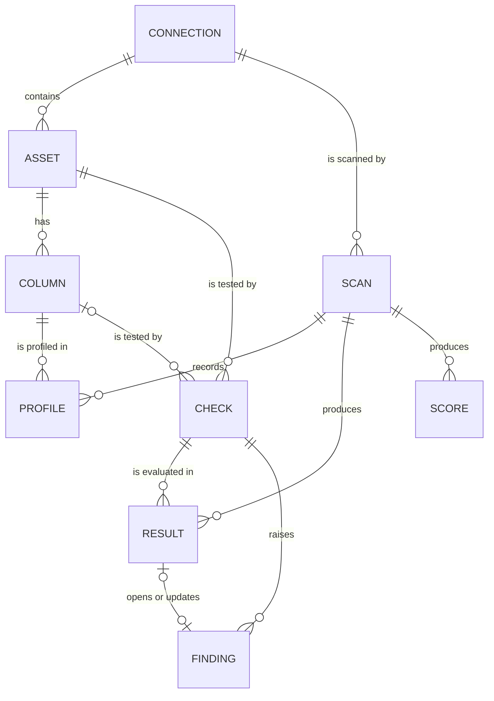

# Domain model

The vocabulary every package uses. Python names in `core/` and `api/` follow these terms;
the database tables are in the specs that create them (001, 004).

## Entities

| Entity | What it is | Key fields |
|---|---|---|
| **Connection** | A store Sahifa may read: uploaded files, a DuckDB source (local or S3 paths), a Postgres database; later Snowflake, BigQuery, Iceberg | `id`, `name`, `kind`, `config` (non-secret JSON), `secret_ref` (name of the env var or key holding the credential, never the credential), `created_at` |
| **Asset** | A table, view or file set inside a connection | `id`, `connection_id`, `namespace` (schema or folder), `name`, `kind` (`table`, `view`, `file`), `row_count`, `last_scan_id` |
| **Column** | A column of an asset | `asset_id`, `name`, `position`, `physical_type`, `logical_type` (`integer`, `decimal`, `boolean`, `text`, `date`, `timestamp`, `json`, `binary`, `other`), `semantic_type` (inferred, e.g. `email`, `iban`; null if none), `role` (`key`, `foreign_key`, `measure`, `attribute`, `timestamp`, `description`) |
| **Scan** | One assessment of a connection, or of selected assets in it | `id`, `connection_id`, `status` (`queued`, `running`, `succeeded`, `failed`), `scope` (asset names, or all), `sample_rows`, `started_at`, `finished_at`, `error`, `stats` |
| **Profile** | The measured characteristics of one column in one scan | counts (rows, nulls, blanks, distinct), min, max, mean, stddev, quantiles, lengths, top values, pattern classes, semantic-type shares; see "Profile" below |
| **Check** | A rule about an asset or column, from the catalogue | `id`, `asset_id`, `column`, `type` (e.g. `sah.not_null`), `params`, `dimension`, `severity`, `origin` (`generated`, `manual`, `suggested`), `status` (`proposed`, `active`, `locked`, `retired`), `version` |
| **Result** | The evaluation of one check in one scan | `scan_id`, `check_id`, `evaluated` (n), `failed` (k), `population` (N), `ratio`, `interval`, `passed`, `evidence` |
| **Finding** | A failed check that needs a person: what failed, where, how much, why | `id`, `check_id`, `severity`, `status` (`open`, `acknowledged`, `resolved`, `muted`), `first_scan_id`, `last_scan_id`, `occurrences`, `summary`, `evidence` |
| **Score** | A dimension score at one level of one scan | `scan_id`, `level` (`column`, `asset`, `store`), `ref`, `dimension` (or `overall`), `value`, `low`, `high`, `evaluated` |

Not in R1: org, workspace and membership (R2, the Tabayyun authz model, ADR-0010),
contract (R2, ODCS, ADR-0013), lineage edge (R3).

## Profile

Computed per column by one aggregate query per asset (spec 002), on the scan's sample:

| Group | Measures |
|---|---|
| Counts | `rows`, `nulls`, `distinct` (exact up to 1 M rows in the sample, approximate above), `blanks` (empty or whitespace-only text, and the null-like tokens `n/a`, `na`, `null`, `none`, `-`, `?`, `unknown`) |
| Numbers | `min`, `max`, `mean`, `stddev`, `p01`, `p25`, `median`, `p75`, `p99`, `zeros`, `negatives`, `mad` (median absolute deviation) |
| Text | `min_length`, `max_length`, `mean_length`, `leading_trailing_space`, `non_printing`, `numeric_like` (parses as a number), `date_like` (parses as a date), `upper`, `lower`, `mixed_case` |
| Time | `min`, `max`, `future` (after scan time), `before_1900`, `sentinel` (1900-01-01, 1970-01-01, 9999-12-31) |
| Values | `top` (up to 20 most frequent values with counts), `patterns` (up to 10 pattern classes with counts: letters → `A`, digits → `9`, other characters kept, runs collapsed above 4) |
| Semantics | `semantic_type` and its share among non-null values, from the rule packs (`email`, `url`, `uuid`, `iban`, `eu_vat`, `iso_country`, `iso_currency`, `phone_e164`, `postcode_de`, …) |

The profile is stored with the scan, so the next scan can compare against it (R2 history).

## Quality dimensions

Sahifa reports six dimensions. Each maps to an ISO/IEC 25012 characteristic, so a report can
be read in either vocabulary. The names are DAMA's because data teams know them; currentness
replaces timeliness because that is ISO's word for "is it recent enough".

| Dimension | ISO/IEC 25012 characteristic | Question | Example checks |
|---|---|---|---|
| **Completeness** | Completeness | Are the values that should be there present? | `sah.not_null`, `sah.not_blank`, `sah.row_count` |
| **Validity** | Accuracy (syntactic), Compliance | Do values have the right type, format and domain? | `sah.type_conformance`, `sah.pattern`, `sah.semantic_format`, `sah.accepted_values`, `sah.length` |
| **Accuracy** | Accuracy (semantic) | Are values plausible for what they describe? | `sah.range`, `sah.outliers`, `sah.future_dates`, `sah.implausible_dates` |
| **Consistency** | Consistency | Do values agree with each other and across tables? | `sah.foreign_key`, `sah.column_order`, `sah.casing_variants`, `sah.mixed_types` |
| **Uniqueness** | Consistency (no duplicate records) | Is every entity recorded once? | `sah.unique`, `sah.duplicate_rows` |
| **Currentness** | Currentness | Is the data recent enough? | `sah.freshness` |

ISO/IEC 25024 defines quality measures for these characteristics as ratios of conforming
items to items evaluated. Sahifa's ratio for every check has that form (n evaluated, k
failed). The exact 25024 measure identifiers are added to the catalogue once the standard
text has been bought and read (TASKS.md, R1 follow-up); until then the mapping above is the
characteristic level only.

Store health (empty tables, tables without a primary key, numbers stored as text, later
unused tables and small files) is reported next to the scores but is not a quality
dimension and does not change them.

## Scoring (v1, ADR-0004)

1. **Check ratio.** A check evaluated `n` items and found `k` failing:
   `p = (n − k) / n`. Items are rows for row-level checks, assets for table-level checks.
2. **Check interval.** The 95 % Wilson score interval for `p`, with the finite-population
   correction when the scan read a sample of `n` rows out of `N`: the effective sample size
   is `n_eff = n · (N − 1) / (N − n)`; a full read (`n = N`) gives a zero-width interval.
   The interval expresses sampling uncertainty only.
3. **Column dimension score.** The checks of one column in one dimension combine as a
   weighted geometric product, the share of items that pass all of them if failures were
   independent: `S = Π p_i ^ w_i`, with `w` from the check's severity (critical 1.0, high
   0.6, medium 0.3, low 0.1). The interval follows from the delta method on `log S`:
   `Var(log S) = Σ w_i² · Var(p_i) / p_i²`.
4. **Asset dimension score.** The weighted mean of its column scores in that dimension plus
   its table-level checks. Column weights come from the column role: key 3, foreign key
   2.5, timestamp 2, measure 1.5, attribute 1, description 0.5. Weighted means of
   independent estimates propagate their variance as `Σ v_i² Var_i / (Σ v_i)²`.
5. **Store dimension score.** The weighted mean of asset scores, weighted by
   `1 + log10(1 + rows)`, so a large table counts more without drowning the rest.
6. **Overall.** The unweighted mean of the dimensions that have at least one check, at each
   level. All scores are shown on 0–100 with one decimal.

These rules satisfy the five requirements of Heinrich et al. (bounded range, interval scale,
reliable parameters, sound aggregation, cost-efficiency): every value is in [0, 100], equal
differences mean equal differences in pass share, parameters are visible in the report,
every level is a weighted mean of the level below, and nothing is computed twice.

## Finding rules

- A result becomes a finding when `p < 1 − tolerance`, where the tolerance is the check's
  `max_fail_ratio` parameter (default 0 for keys and declared constraints, set from the
  profile for generated checks; catalogue).
- Severity is the check's severity. Within a scan, one check yields at most one finding.
- R1 keeps findings per scan. R2 (spec 008) keeps one open finding per check across scans,
  counting occurrences, with the Tabayyun lifecycle (open, acknowledged, resolved, muted).

## Raw data and proposals

Sahifa stores profiles, counts, at most 5 example failing values per finding (truncated to
200 characters, masked when the column's semantic type is personal: email, phone, IBAN, VAT
ID) and the SQL it ran. It does not copy tables. Proposed fixes (R3) are SQL or dbt snippets
attached to a finding; applying them is the owner's job.
