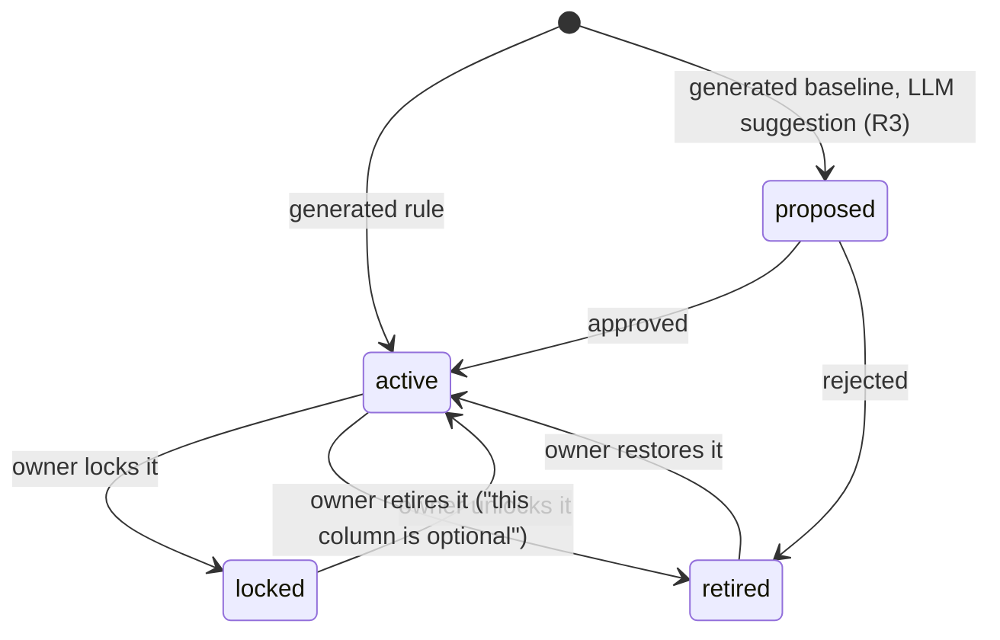

# Check specification

Every check, built-in or custom, is described by the same manifest, produces the same result
shape and scores the same way. The engine does not care whether a check is evaluated in the
source database or in Python.

## Manifest

Built-in checks declare their manifest as class attributes in `core/src/sahifa_core/checks/`;
custom checks (R2) are YAML with the same fields.

```yaml
id: sah.not_null                # namespace.name; "sah" is reserved for built-ins, "store" for store health
version: 1                      # bump when semantics or default thresholds change
title: Missing values
dimension: completeness         # completeness | validity | accuracy | consistency | uniqueness | currentness
iso_25012: completeness         # the ISO/IEC 25012 characteristic (domain model, "Quality dimensions")
level: column                   # column | asset
kind: rule                      # rule: an opinion that holds for any data, active when generated
                                # baseline: learned from this data, proposed when generated
applies_to:
  logical_types: [any]          # integer | decimal | boolean | text | date | timestamp | json | any
  roles: [any]                  # key | foreign_key | measure | attribute | timestamp | description | any
parameters:                     # defaults are the product opinion
  max_fail_ratio:
    type: number
    default: by_role            # 0 for key, foreign_key, timestamp; 1.0 (score only) otherwise
severity_default: by_role       # critical | high | medium | low, or a rule documented in the catalogue
evaluation: sql                 # sql: a fail predicate run in the source; python: on grouped values
explain: "{failed} of {evaluated} rows have no value in {column} ({fail_pct})."
```

## Execution contract

```
applies(profile: ColumnProfile | AssetProfile, context) -> bool
generate(profile, context) -> CheckSpec | None            # params from the profile, or None
fail_predicate(spec, dialect) -> SQL                      # evaluation: sql
evaluate(spec, values: list[(value, count)]) -> (n, k)    # evaluation: python
```

- `context` carries the asset's other columns and profiles, the other assets in the scan
  (for foreign keys), the scan time and the connection's dialect.
- An SQL check contributes one `SUM(CASE WHEN <predicate> THEN 1 ELSE 0 END)` column to the
  asset's single evaluation query; `n` is the count of rows the check applies to (non-null
  rows for value checks). Asset-level checks evaluate to `n = 1`, `k ∈ {0, 1}`.
- A Python check receives the column's `(value, count)` groups on the sample, at most 50,000
  groups; when the column has more, it evaluates the most frequent 50,000 and says so in the
  evidence (`truncated: true`).
- For every failing check the engine fetches up to five example values with counts.
- Checks are **pure** (no I/O of their own) and **deterministic** for a given sample.
- Predicates use only the dialect helpers in `sql.py`. Identifiers are quoted and literals
  rendered by SQLGlot; no value from the data is ever concatenated into SQL as text.

## Lifecycle (ADR-0005)



- Only `active` and `locked` checks count toward scores and raise findings. `proposed` checks
  are evaluated and shown with what they would report.
- Regeneration (each scan from sprint 2) updates the parameters of `active` generated checks
  from the new profile, never touches `locked` or `manual` checks, and never re-creates a
  `retired` one.
- In R1 sprint 1 checks live inside the scan report and are regenerated every scan; sprint 2
  persists them per asset (spec 007).

## Threshold strategy

1. **Declared metadata first.** Declared primary keys, unique constraints, foreign keys, NOT
   NULL constraints and column types from the source.
2. **The product opinion second.** Rules carry fixed thresholds (a blank is never valid, an
   IBAN must pass mod-97, a key must be unique).
3. **The profile third.** Baselines take their parameters from the profile: the observed
   range, value set, lengths and patterns. From R2, from the profile history with a chosen
   false-alarm rate (ADR-0004 follow-up, research 03 "Auto-Validate-by-History").
4. **Explicit override last.** The owner edits parameters and locks the check.

## Severity and weight

| Severity | Weight | Meaning |
|---|---|---|
| critical | 1.0 | The affected rows break joins, keys or the table's purpose. |
| high | 0.6 | Most consumers should not use the affected rows without treatment. |
| medium | 0.3 | Needs attention; consumers may tolerate it. |
| low | 0.1 | Hygiene; affects presentation or long-term trust more than use. |

The weight is the exponent in the column's dimension score (domain model, "Scoring"): a
low-severity check that fails half the rows lowers its dimension from 1.0 to 0.93, a
critical one to 0.5.

## Result

```json
{
  "check": "sah.semantic_format",
  "asset": "public.customers", "column": "iban",
  "params": {"semantic_type": "iban"},
  "status": "active", "severity": "high", "dimension": "validity",
  "evaluated": 2100000, "failed": 630, "population": 2100000,
  "ratio": 0.9997, "low": 0.9997, "high": 0.9997,
  "passed": false,
  "summary": "630 of 2,100,000 values in customers.iban are not valid IBANs (0.03 %).",
  "examples": [{"value": "DE89••••••••••••••••01", "count": 12, "masked": true}],
  "sql": "SELECT ... FROM ...",
  "truncated": false
}
```
