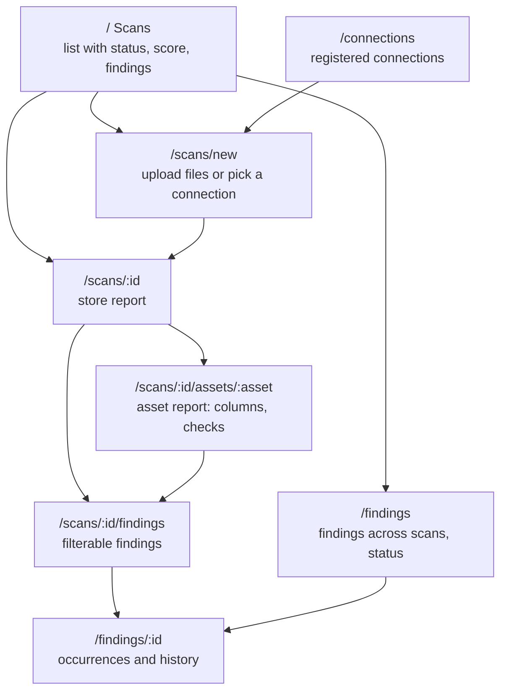

# Frontend design

## Stack

Vite + React 19 + TypeScript, TanStack Router (file-free route tree in `router.tsx`) and
TanStack Query, Tailwind v4, vitest with Testing Library. Served by Caddy (ADR-0007). No chart
library in R1: score bars and interval bars are plain elements on a 0–100 scale, as on the
product page; uPlot arrives with the score history (spec 011).

## Visual language

Taken from the product page (`site/index.html`), so the app and its page read as one thing:

| Token | Light | Dark | Use |
|---|---|---|---|
| `--bg` | `#eef1f5` | `#0d1220` | page |
| `--surface` | `#fbfcfd` | `#151c2e` | cards, tables |
| `--line` | `#d3dae4` | `#283350` | borders, rules |
| `--fg` | `#141b2d` | `#e8ecf4` | text |
| `--muted` | `#4a5569` | `#a6b0c5` | secondary text |
| `--accent` | `#2b4fb3` | `#93abff` | links, primary buttons, score intervals |
| `--ok` / `--warn` / `--bad` | `#1d7a4c` / `#9a5c06` / `#b3303a` | `#4cc38a` / `#e3a440` / `#f2777f` | status chips and severities only |

Type: Bricolage Grotesque for headings and the big score, Figtree for text, IBM Plex Mono
with tabular figures for every number, identifier and SQL. Fonts are self-hosted in the
image (no request to Google from the app).

Score display: the value with one decimal, the interval in mono beside it ("92.7 · 92.3–93.1");
interval bars on an 80–100 or 0–100 axis, the axis labelled. Severity: critical and high in
`--bad`, medium in `--warn`, low in `--muted`; never colour alone, always the word.

## Information architecture

R2 adds sign-in, the workspace switcher, `/findings` across scans (spec 009, in place),
`/assets/:id` history and the admin panel; R3 the store health page and contract editor.

## Key screens (R1)

### Scans

A table: when, source (connection name or "Upload: 3 files"), status chip, overall score with
interval, open findings by severity, duration. "New scan" is the primary action. Running
scans poll every 2 s until they finish (`useScanPolling`).

### New scan

Two tabs: **Upload files** (drop zone and file picker, accepted extensions and limits shown,
file list with sizes) and **Connection** (the registered connections, with a "Test" button
showing how many assets it sees). Sample size: a number field with "Read everything" as an
explicit checkbox. Submitting goes to the report, which shows the progress until done.

### Store report

1. Header: source, scan time, sample policy, duration.
2. Score card: overall score with interval, the six dimensions as interval bars, a sentence
   on what the interval covers ("sampling uncertainty from 100,000 of 2.1 M rows per table").
3. Findings summary: counts per severity and the five most severe findings, link to all.
4. Assets table: name, rows (sampled or full), score with interval, worst dimension, findings.
5. Store health: the R1 health items as a short list.
6. Proposed checks: how many baselines were proposed, with what they would report.

### Asset report

Columns as rows: name, logical type, role, semantic type, null share, distinct, the column's
score and worst dimension; expanding a row shows the full profile (statistics, top values,
patterns) and its checks with ratio, interval, status chip and summary. Asset-level checks
(row count, duplicates, freshness, column order) above the column table.

### Findings

A list ordered by severity then failed share: the summary sentence, the check id, asset and
column, failed of evaluated with the interval, example values (masked where personal), the
SQL in a collapsible block with a copy button, and the suggested next step. Filters:
severity, dimension, asset. Since spec 009 each item also shows its finding's status chip and
links to the finding across scans.

### Findings across scans (spec 009)

`/findings`, in the main navigation: one card per finding (one per failing check), by default
those needing attention (open, acknowledged, muted), most severe and most recently seen first,
with "Load more". Filters: status, severity, connection. A card shows the latest summary, the
check title, asset and column, severity and status chips, "Seen N times, first … last …", the
mute end when muted, and the actions the status allows ("Acknowledge", "Resolve", "Mute…",
"Unmute", "Reopen"). "Mute…" opens a small form with an optional end date and note; "Add a
note" attaches an optional note to the next action. Actions update the card in place; a 409
`stale_version` reloads the list with a notice. "Show history" expands the occurrences (examples
masked where personal, SQL, next step) and the events, notes rendered as text.
`/findings/:id` shows one finding with its history open.

## Responsive and mobile

Every screen works at 390 px: tables become stacked cards below 720 px, the dimension bars
keep their axis, SQL blocks scroll inside their own box. No horizontal page scroll.

## Security in the frontend

No tokens in browser storage (R2 uses the BFF cookie); CSP without inline scripts or styles
from the API; every value from the data is rendered as text, never as HTML; example values
are already masked by the API.

## Accessibility

WCAG 2.2 AA: contrast of all tokens checked in both themes, focus rings visible, status never
by colour alone, tables with header cells, the score bars with `aria-label`s that read the
value and interval, reduced motion respected.
