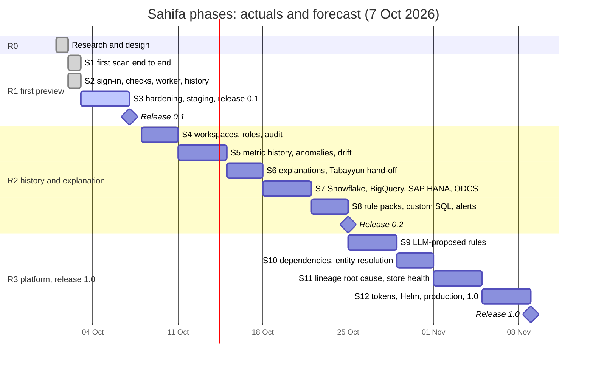

# Sahifa — Roadmap

- **Version 2, 3 Oct 2026.** Version 1 was written on 2 Oct, at the end of R0.
- **Cadence:** scope sprints with a rolling forecast, as in Tabayyun. A sprint starts when the
  previous one's last PR is merged; one spec per story, one PR per spec, CodeRabbit review, and
  every merge to `main` deploys staging. The story-level plan is in [`sprints.md`](sprints.md).
- **Capacity assumption:** the owner as product owner, plus AI coding agents. Measured pace so
  far: sprint 1 in one day, sprint 2 (six specs) in one and a half. The forecast plans at **2–3
  sprints per week**, because R2 and R3 carry statistics research and third-party systems
  (Snowflake, BigQuery, SAP, an LLM endpoint). Items that wait on people do not compress with
  it; see [owner and external dependencies](sprints.md#owner-and-external-dependencies).
- **Public dates:** the product page (`site/index.html`) shows the public plan, deliberately
  more conservative than this forecast.

## Where we are (7 Oct 2026)

| | |
|---|---|
| **Phase** | R1 first preview: release 0.1 (`v0.1.0`, staging only) is being tagged; R2 starts with sprint 4 |
| **Done** | R0; sprints 1–3: scan end to end, sign-in, checks lifecycle, worker, findings across scans, schedules, score history, security baseline, performance run, accuracy benchmark |
| **In review** | S3-5 release 0.1 (PR #25); `v0.1.0` is tagged on its merge commit |
| **Next** | Sprint 4: workspaces, roles, audit, security follow-ups |
| **Waiting on the owner** | the G1 staging check (sign-in with three methods, a scheduled scan, the score history); nginx upload size on `sahifa-stg-web`; Delete Credential in Keycloak; production apps for the promote dry run; an SMTP account for sprint 4 |

## How to follow

- **This page:** the status table above, the phase table and the progress log at the end. It
  is updated when a sprint ends or a gate is passed.
- **[`sprints.md`](sprints.md):** every story with its priority and "done when", the actual
  dates and PRs per sprint, and what the owner needs to provide by when.
- **[`TASKS.md`](../../TASKS.md):** one entry per spec with the decisions taken while building
  it, and what is still pending for the owner.
- **Specs:** [`docs/specs/`](../specs/) hold one file per story, written and approved before
  any code.
- **Email:** after every merge and staging deploy, with what changed and what to check.

## Why this order

1. **A trustworthy first scan before anything else (R1).** The value of a data-quality tool
   rests on findings people believe. Every check fires on the faulty synthetic shop and stays
   silent on its clean twin, every score has an interval (ADR-0004), and a scan never writes
   to a source (ADR-0006).
2. **Sign-in and the checks lifecycle early.** Without them nobody can use a shared install.
   Sign-in was pulled forward from sprint 4 to sprint 2 (ADR-0010).
3. **History before explanation (R2).** Anomalies, drift and "is this getting worse" need the
   metric history of many scans. Explanations need findings that persist across scans, which
   sprint 2 delivered.
4. **More sources where the data lives (R2).** Snowflake, BigQuery and SAP come after the
   engine is proven on Postgres and files, because each brings its own SQL dialect and
   accounts that the owner has to provide.
5. **AI last (R3).** An LLM may propose rules, but a person approves them and they run
   deterministically. That needs the lifecycle, the history and an evaluation set first.

## Phases at a glance



| Phase | Sprints | Dates (actual / forecast) | Outcome and exit criteria | Release | Status |
|---|---|---|---|---|---|
| **R0 Research and design** | — | 1–2 Oct | Research 01–04, vision, domain model, architecture, ADRs 0001–0014, the catalogue of 30 checks, specs 001–005, product page | — | ✅ done |
| **R1 First preview** | S1–S3 | 2 Oct – 7 Oct | Files and Postgres scanned with 20 checks; scores with intervals; findings with examples, SQL and a next step; sign-in; checks lifecycle; worker; findings across scans; schedules; history. Security baseline, performance budget, accuracy table and staging live; the owner's staging check and the promote dry run before production (gate G1). | `v0.1.0` | 🔄 release 0.1 in PR #25 |
| **R2 History and explanation** | S4–S8 | ~8 Oct – ~24 Oct | Workspaces and roles; metric history with anomaly thresholds and drift; explanations of where failures cluster; Snowflake, BigQuery, SAP HANA, S3 and Iceberg; ODCS contracts; SAP and EU rule packs; custom SQL checks; alerts | `v0.2.0` | ⏳ next |
| **R3 Platform** | S9–S12 | ~24 Oct – ~7 Nov | Rules proposed by an LLM and approved by a person; dependencies and entity resolution; lineage root cause; store health; API tokens, reports, embeds; Helm and multi-node workers; production with tested restore | `v1.0.0` | ⏳ later |

## Milestone gates

1. **G1, end of S3, release 0.1:**
   - the security baseline is ticked (spec 012) and the performance budget is met (spec 013);
   - the accuracy table is in `docs/checks/catalogue.md`;
   - the owner has checked staging: sign-in with all three methods, a scheduled scan, the
     score history;
   - the promote dry run to production has passed;
   - then `v0.1.0` is tagged from `main`.

   **At the tag, 7 Oct.** Met: security baseline, performance budget, accuracy table, staging
   live (deployed and serving, not yet checked by the owner). Not yet done, by the owner's
   decision of 7 Oct: the owner's staging check and the promote dry run. Both are done before the first production deploy (S3-3), which is when 0.1
   reaches production (spec 015).
2. **G2, end of S5:**
   - the role matrix test covers every route and role;
   - anomaly thresholds keep their chosen false-alarm rate on synthetic history with injected
     shifts.
3. **G3, end of S8, release 0.2:**
   - Snowflake and BigQuery give the same findings as DuckDB on the shop;
   - the SAP pack fires on an anonymised sample;
   - alerts reach email and a webhook.
4. **G4, end of S12, release 1.0:**
   - production runs with backups and a timed restore drill;
   - all 30 catalogue checks are implemented and in the accuracy table;
   - proposed LLM rules meet their precision target on the eval set;
   - the docs are complete.

## Releases

| Release | Scope (exit criteria above) | Target |
|---|---|---|
| **R1 first preview, `v0.1.0`** | Sprints 1–3 | ~8 Oct 2026 |
| **R2 history and explanation, `v0.2.0`** | Sprints 4–8 | ~24 Oct 2026 |
| **R3 platform, `v1.0.0`** | Sprints 9–12 | ~7 Nov 2026 |

### R1 — First preview, release 0.1 (sprints 1–3)

- A scan of uploaded CSV, Parquet or JSON files, or of a Postgres database registered through
  `SAHIFA_CONN_*`, profiles every asset, runs the 20 R1 checks and reports scores per
  dimension with 95 % intervals at column, asset and store level.
- Each finding has a plain-language summary, counts, at most five example values (masked
  where personal), the SQL that found them and a suggested next step.
- Checks persist per asset with the lifecycle proposed → active → locked → retired; a re-scan
  keeps locked checks and updates active ones. Findings persist across scans with their
  status.
- Scans run in a Procrastinate worker, on demand or on a schedule; scores keep their history.
- People sign in through Keycloak with Google, GitHub or a passkey.
- Images are published to GHCR and deployed to `sahifa-stg.siralabs.org` by `release.yml`;
  production is promoted by `promote.yml` after approval.
- Every R1 check fires on the synthetic shop and stays silent on its clean twin. A 1,000-table
  Postgres schema scans in under 10 minutes on 2 vCPU.

### R2 — History and explanation (sprints 4–8)

- Organisations, workspaces and connections with roles (viewer, editor, admin), row-level
  security and an audit log (ADR-0010).
- Metric history per check and column; anomaly thresholds with a chosen false-alarm rate (STL
  baselines, conformal thresholds); drift with effect sizes and PSI critical values (checks
  16, 17, 24, 29).
- Explanations of where failing rows cluster (MacroBase DIFF, Data X-Ray) on every finding;
  the time-series hand-off to `tabayyun_core` (ADR-0011).
- Snowflake and BigQuery connectors; S3 and Iceberg through DuckDB; SAP HANA, BW/4HANA and
  Datasphere through the optional `sahifa-connector-hana` package (ADR-0014).
- ODCS v3 contract inference and export, and contracts imported as manual checks (ADR-0013).
- The SAP rule pack; European rule packs (postcodes, VAT per country, national IDs where
  lawful); code lists; custom SQL checks (checks 11, 21, 23, 30).
- Alerts to email and webhooks.

### R3 — Platform, release 1.0 (sprints 9–12)

- Rules proposed by an LLM, approved by a person and run deterministically (the LLMClean and
  ZeroED pattern); bring your own model endpoint.
- Approximate functional dependencies mined and ranked (check 22); entity resolution with
  Splink (check 27).
- Lineage-aware root cause with OpenLineage and SQLGlot column lineage.
- A store health report: unused and duplicate tables, small files in Iceberg and Delta,
  missing indexes, normalisation advice.
- API tokens, scheduled reports and embeds; a Helm chart; multi-node workers; production with
  backups and a restore drill.

## Risks

| Risk | Likelihood | Mitigation |
|---|---|---|
| Owner time across the portfolio (Arqam, Suffa, Tabayyun, Sahifa) | High | Specs keep each session self-contained; a budget stop moves dates, not scope; checks that wait on the owner are listed with their sprint. |
| External accounts late (Snowflake, BigQuery, SAP HANA, LLM endpoint) | Medium | S7 and S9 can start with what is there; connectors are tested against emulators or trials first; the order within R2 can swap. |
| Anomaly thresholds raise false alarms | Medium | A chosen false-alarm rate, calibrated on synthetic history with known shifts (gate G2); thresholds start as proposals that a person approves. |
| Findings people do not trust | Medium | Accuracy benchmark per check (S3-4); examples and SQL on every finding; proposed checks never score until approved (ADR-0005). |
| A scan harms a production source | Low | Read-only sessions with statement and lock timeouts (ADR-0006); query budget per asset (spec 013); `SAHIFA_SCAN_WORKERS` lowers the load. |
| Warehouse cost and speed (Snowflake, BigQuery) | Medium | Sampling pushed down, the query budget kept per asset, a cost estimate before a first scan. |
| LLM proposals wrong or leaking data | Medium | Only profiles and masked examples leave the install; a person approves every rule; precision measured on an eval set (G4). |
| Scope creep (lineage, store health, mobile, more sources) | High | Phase exit criteria; R3 is the buffer; new ideas go to `TASKS.md` as stories, not into a running sprint. |

## Repository layout

```
core/            sahifa-core: connectors, profiling, checks, scoring, report, CLI (uv)
api/             sahifa API: FastAPI, SQLAlchemy, Alembic, Procrastinate (uv), depends on ../core
web/             React SPA (pnpm), served by Caddy
deploy/          compose bundles, Caddy, CapRover guide, Keycloak realm
docs/            research, architecture, ADRs, checks, frontend, roadmap, specs, security
security/        licence policy and accepted advisories for the CI audits
site/            product page for siralabs.org
.github/         CI, release, promote, scripts, templates
```

## Progress log

| Date | What |
|---|---|
| 2026-10-01 | Research 01–04 in the planning session; name and repository chosen |
| 2026-10-02 | R0 complete: docs, ADRs, catalogue, specs 001–005, product page; sprint 1 started |
| 2026-10-02 | SAP data added to the plan (ADR-0014): HANA connector and SAP rule pack in R2 |
| 2026-10-02 | Sprint 1 merged (PR #1): engine, API, web; images on GHCR |
| 2026-10-02 | Spec 006 done (PRs #2, #3): staging signs in through Keycloak with Google, GitHub and passkeys |
| 2026-10-02 | Spec 007, checks persisted with lifecycle (PR #6); spec 008, Procrastinate worker on staging (PR #7) |
| 2026-10-03 | Spec 009, findings across scans (PR #9); spec 010, scheduled scans (PR #10); spec 011, score history (PR #11); **sprint 2 done** |
| 2026-10-03 | Spec 012, security baseline (PR #13); ADR-0015 allows psycopg's LGPL-3.0 |
| 2026-10-03 | Spec 013, performance run (PR #14): 1,000 tables in 8 min 13 s on 2 vCPU; the foreign-key check made linear |
| 2026-10-03 | Roadmap version 2: status, gates, risks; sprints 4–12 planned to story level |
| 2026-10-07 | Spec 014, accuracy benchmark (PR #24): 100 % detection on a full read, a silent clean twin; locked `range` baselines raise false alarms on new data (follow-up, sprint 5) |
