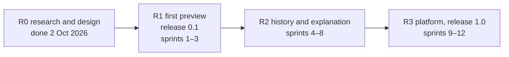

# Roadmap

Three releases after the research phase, as in Tabayyun. Sprints are units of scope with a
rolling forecast (`sprints.md`); dates on the product page (`site/index.html`) are the public
plan and deliberately more conservative than the forecast.



## R0 — Research and design (done 2 Oct 2026)

- Research 01–04: DataKitchen TestGen as reference, the tool landscape, research methods,
  synthesis and positioning (`docs/research/`).
- Vision, domain model and scoring, system architecture (`docs/architecture/`).
- ADRs 0001–0013 (`docs/adr/`), check specification and the first 30 checks
  (`docs/checks/`), frontend design (`docs/frontend/`).
- Sprint plan, specs 001–005, backlog (`TASKS.md`), CapRover deployment plan
  (`deploy/caprover.md`), product page design (`site/index.html`).

## R1 — First preview, release 0.1 (sprints 1–3)

Exit criteria:

- A scan of uploaded CSV, Parquet or JSON files, or of a Postgres database registered through
  `SAHIFA_CONN_*`, profiles every asset, runs the 20 R1 checks and reports scores per
  dimension with 95 % intervals at column, asset and store level.
- Each finding has a plain-language summary, counts, at most five (masked where personal)
  example values, the SQL that found them and a suggested next step.
- Checks persist per asset with the lifecycle proposed → active → locked → retired; a
  re-scan keeps locked checks and updates active ones.
- Scans run in a Procrastinate worker; scans can be scheduled.
- The web app lists scans, starts a scan, shows the store report, an asset report with column
  profiles, and the findings.
- Images published to GHCR and deployed to `sahifa-stg.siralabs.org` by `release.yml`;
  production promoted by `promote.yml` after approval.
- Every R1 check fires on the synthetic shop dataset and stays silent on its clean twin; a
  1,000-table Postgres schema scans in under 10 minutes on 2 vCPU.

## R2 — History and explanation (sprints 4–8)

- Sign-in through Keycloak (Google, GitHub, passkeys; pulled forward to sprint 2 as spec 006),
  org → workspace → connection RBAC with row-level security, audit log (ADR-0010).
- Metric history per check and column; anomaly thresholds with a chosen false-alarm rate
  (STL baselines, conformal thresholds); drift with effect sizes and PSI critical values;
  checks 16, 17, 24, 29.
- Findings lifecycle across scans (open, acknowledged, resolved, muted) with deduplication.
- Explanations: where failing rows cluster (MacroBase DIFF, Data X-Ray) on every finding.
- Time-series hand-off to `tabayyun_core` (ADR-0011).
- Snowflake and BigQuery connectors; S3 and Iceberg through DuckDB; SAP HANA, BW/4HANA and
  Datasphere through the optional `sahifa-connector-hana` package (ADR-0014).
- ODCS v3 contract inference and export, import of contracts as manual checks (ADR-0013).
- The SAP rule pack (`sap.*`: DATS dates, ALPHA keys, currency and unit references, client
  consistency, data-dictionary foreign keys; ADR-0014).
- European rule packs (postcodes for the EU, VAT per country, national IDs where lawful),
  code lists, custom SQL checks (11, 21, 23, 30).
- Alerts to email and webhooks.

## R3 — Platform, release 1.0 (sprints 9–12)

- Rules proposed by an LLM, approved by a person, run deterministically (LLMClean and ZeroED
  pattern); bring-your-own model endpoint.
- Approximate functional dependencies mined and ranked (check 22); entity resolution with
  Splink (check 27).
- Lineage-aware root cause with OpenLineage and SQLGlot column lineage.
- Store health report: unused and duplicate tables, Iceberg and Delta small files, missing
  indexes, normalisation advice.
- API tokens, scheduled reports, embeds; Helm chart; multi-node workers.

## Repository layout

```
core/            sahifa-core: connectors, profiling, checks, scoring, report, CLI (uv)
  src/sahifa_core/
  tests/
api/             sahifa API: FastAPI, SQLAlchemy, Alembic (uv), depends on ../core
  src/sahifa/
  tests/
web/             React SPA (pnpm), served by Caddy
deploy/          compose bundles, CapRover guide and captain-definitions
docs/            research, architecture, ADRs, checks, frontend, roadmap, specs
site/            product page for siralabs.org
.github/         CI, release, promote, templates
```

## Progress log

| Date | What |
|---|---|
| 2026-10-01 | Research 01–04 in the planning session; name and repository chosen |
| 2026-10-02 | R0 complete: docs, ADRs, catalogue, specs 001–005, product page; sprint 1 started |
| 2026-10-02 | SAP data added to the plan (ADR-0014): HANA connector and SAP rule pack in R2 |
| 2026-10-02 | Sprint 1 merged (PR #1): engine, API, web; images on GHCR |
