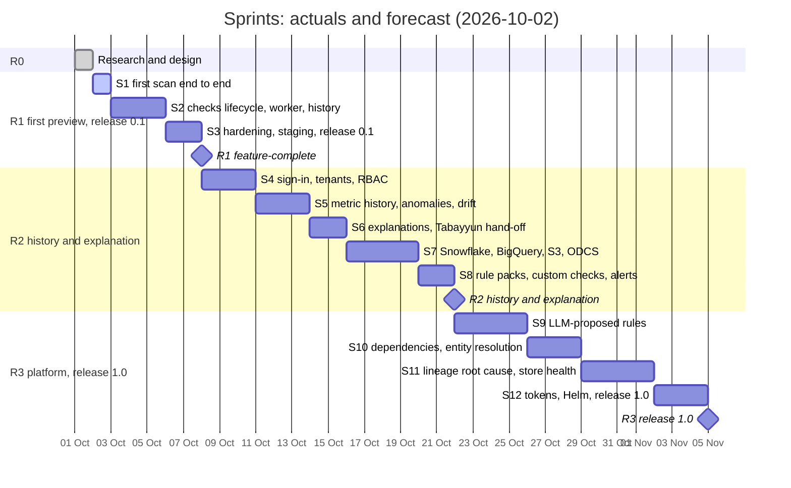

# Sprint plan — scope sprints with a rolling forecast

*Planned 2026-10-02, following the Tabayyun model (re-baselined there on 2026-09-23). A
sprint is a unit of scope: it starts when the previous sprint's last PR is merged, its
stories are ordered by priority, and its dates are recorded when it happens. Dates for the
sprints ahead are a forecast, recomputed at the end of every sprint. One branch per sprint
(`sprint/NN-topic`), one PR per spec, CodeRabbit review, merge by the owner; every merge to
`main` deploys staging.*

The build budget resets every Saturday. When it reaches ~90 % the remaining stories roll into
the next budget week unchanged; nothing is squeezed in. A budget stop moves dates, not scope.

Sizing from Tabayyun sprints 1–6: one session implements one spec (one story, sometimes two)
with tests, review fixes and a live check; one vertical slice through engine, API and web fits
one sprint. Priorities: **M** must (sprint fails without it), **S** should, **C** could.

Every story gets a spec in `docs/specs/` (copy `000-template.md`) before implementation.
`TASKS.md` tracks the specs and the session decisions.

Definition of done for every story: tests (pytest or vitest), lint and type checks clean,
docs touched (`catalogue.md`, an ADR when a design decision is made, the roadmap progress
log), and for user-facing stories a screenshot or curl transcript in the PR.

## Milestones

| Milestone | Sprints | Forecast (2026-10-02) | Exit criteria |
|---|---|---|---|
| **R1 first preview, release 0.1** | 1–3 | feature-complete 7–10 Oct; release when staging is live and validated | `docs/roadmap/roadmap.md`, R1 |
| **R2 history and explanation** | 4–8 | 17–28 Oct | `roadmap.md`, R2 |
| **R3 platform, release 1.0** | 9–12 | 31 Oct – 14 Nov | `roadmap.md`, R3 |

The forecast plans at **2–3 sprints per week**, a third to a half of Tabayyun's measured pace
of about one sprint per working day, because R2 and R3 carry statistics research, third-party
software (Keycloak, Snowflake, BigQuery) and performance work. Items that wait on people
(DNS, servers, accounts) do not compress with it; they are listed under
[Owner and external dependencies](#owner-and-external-dependencies).

## Actuals and forecast

| Sprint | Topic | Forecast end | Actual | PRs |
|---|---|---|---|---|
| 1 | first scan end to end | 2–3 Oct | | |
| 2 | checks lifecycle, worker, history | 4–6 Oct | | |
| 3 | hardening, staging, release 0.1 | 7–10 Oct | | |
| 4 | sign-in, tenants, RBAC | 9–13 Oct | | |
| 5 | metric history, anomalies, drift | 12–17 Oct | | |
| 6 | explanations, Tabayyun hand-off | 14–20 Oct | | |
| 7 | Snowflake, BigQuery, S3, ODCS | 17–24 Oct | | |
| 8 | rule packs, custom checks, alerts | 20–28 Oct | | |
| 9 | LLM-proposed rules | 23 Oct – 2 Nov | | |
| 10 | dependencies, entity resolution | 27 Oct – 6 Nov | | |
| 11 | lineage root cause, store health | 30 Oct – 10 Nov | | |
| 12 | tokens, Helm, release 1.0 | 3–14 Nov | | |

## Owner and external dependencies

| Needed by | Item | Owner action |
|---|---|---|
| S1 (now) | Product page | give push access to `Sira-Labs/siralabs.github.io` (or merge the prepared change): `site/` holds the page; it moves to `sahifa/index.html` there with a card on the organisation page |
| S1 (now) | DNS | `sahifa-stg.siralabs.org` → staging server; later `sahifa.siralabs.org` → production server |
| S1 (now) | CapRover staging apps | `sahifa-db-stg`, `sahifa-api-stg`, `sahifa-web-stg` as in `deploy/caprover.md`; HTTP basic auth on the web app |
| S1 (now) | GitHub environments | `staging` (and later `production`) with `CAPROVER_SERVER`, `CAPROVER_WEB_URL`, app names and tokens; tag ruleset |
| S2 (~3 Oct) | Demo source | optional: a read-only login on a non-production Postgres to scan on staging (`SAHIFA_CONN_DEMO`) |
| S2 (~3 Oct) | Worker app | `sahifa-worker-stg` with its app token (`CAPROVER_APP_TOKEN_WORKER`) |
| S3 (~6 Oct) | Performance run | a Postgres with ~1,000 tables (the TPC-DS or a copy of a real schema without personal data) |
| S3 (~6 Oct) | ISO/IEC 25024 | buy the standard text so the catalogue can cite measure identifiers |
| S4 (~8 Oct) | Sign-in | Keycloak realm `sahifa` on `miftachun.apps.data-and-ai-dude.ch`; Google and GitHub OAuth clients |
| S6 (~14 Oct) | Tabayyun wheel | publish `tabayyun_core` wheels (Tabayyun release job) so Sahifa can depend on it |
| S7 (~16 Oct) | Warehouses | Snowflake and BigQuery test accounts (trial or sandbox) |
| S9 (~22 Oct) | LLM endpoint | an API key or a self-hosted OpenAI-compatible endpoint for rule proposals |
| S12 (~2 Nov) | Production | production server apps, backups and the first timed restore drill |

## Sprint 1 — first scan end to end (2 Oct 2026)

Goal: a person uploads files or picks a registered Postgres connection, and gets a store
report with scores, intervals and findings in the browser; the same report from the CLI.

| ID | Story | Prio | Spec | Done when |
|---|---|---|---|---|
| S1-1 | Repository scaffold, CI, release and deploy pipeline (no-op until the owner configures CapRover) | M | 001 | `ci` green on `main`; `release` publishes both images |
| S1-2 | Core: DuckDB and Postgres connectors, sampling, column profiles, role and semantic inference | M | 002 | profile of the synthetic shop matches its known truth |
| S1-3 | Core: the 20 R1 checks, scoring with intervals, report, CLI (`sahifa scan`, `sahifa synth`) | M | 003 | every R1 check fires on the faulty shop and not on the clean one |
| S1-4 | API: connections from `SAHIFA_CONN_*`, scans on uploads and connections, persistence, version and health | M | 004 | `POST /api/scans/upload` → report via `GET /api/scans/{id}/report` |
| S1-5 | Web: scans list, new scan, store report, asset report, findings | S | 005 | the round trip works in the browser after a refresh |
| S1-6 | Product page in the Sira Labs site | S | — | page merged in `siralabs.github.io` (needs access) |

## Sprint 2 — checks lifecycle, worker, history

Goal: checks belong to assets and survive scans; scans run in a worker and on a schedule.

| ID | Story | Prio | Done when |
|---|---|---|---|
| S2-1 | Spec 006: assets, columns and checks persisted; approve, lock, retire, restore; regeneration rules of ADR-0005 | M | a locked check keeps its parameters across scans |
| S2-2 | Spec 007: Procrastinate worker, `sahifa-worker` app, stale-scan reaper, upload clean-up job | M | a scan posted to staging runs on the worker |
| S2-3 | Spec 008: findings persisted across scans with deduplication and occurrences; status changes | M | a re-scan does not duplicate findings |
| S2-4 | Spec 009: scheduled scans per connection (cron expression) | S | a nightly scan runs on staging |
| S2-5 | Spec 010: score history per asset and store; sparkline in the report | S | the store page shows the last 30 scans |

## Sprint 3 — hardening, staging, release 0.1

| ID | Story | Prio | Done when |
|---|---|---|---|
| S3-1 | Security baseline pass: headers, upload hardening, rate limits, dependency and licence audit in CI (ADR-0008) | M | checklist ticked |
| S3-2 | Performance run on a 1,000-table schema; query budget per asset | M | under 10 minutes on 2 vCPU, numbers in the PR |
| S3-3 | Staging live at `sahifa-stg.siralabs.org`, promote dry run to production | M | `promote.yml` verified |
| S3-4 | Accuracy benchmark: injected faults detected and false positives on clean twins, per check | S | table in `docs/checks/catalogue.md` |
| S3-5 | Release 0.1: changelog, tag, product page status "Preview" | M | `v0.1.0` tag from `main` |

## Sprints 4–12

Scoped from `roadmap.md` at the end of sprint 3; each story gets its spec first.
