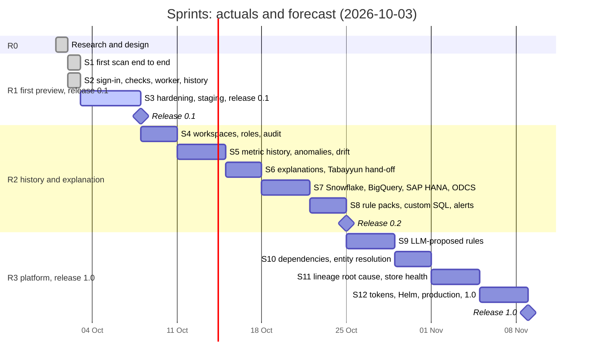

# Sprint plan — scope sprints with a rolling forecast

*Planned 2026-10-02, re-forecast 2026-10-03 at the end of sprint 2; following the Tabayyun model (re-baselined there on 2026-09-23). A
sprint is a unit of scope: it starts when the previous sprint's last PR is merged, its
stories are ordered by priority, and its dates are recorded when it happens. Dates for the
sprints ahead are a forecast, recomputed at the end of every sprint. One branch per sprint
(`sprint/NN-topic`), one PR per spec, CodeRabbit review, merge by the owner; every merge to
`main` deploys staging.*

The build budget resets every Saturday. When it reaches ~90 % the remaining stories roll into
the next budget week unchanged; nothing is squeezed in. A budget stop moves dates, not scope.

Sizing from Tabayyun sprints 1–6: one session implements one spec (one story, sometimes two)
with tests, review fixes and a live check; one vertical slice through engine, API and web fits
one sprint. Priorities: **M** must (sprint fails without it), **S** should, **C** could.

Every story gets a spec in `docs/specs/` (copy `000-template.md`) before implementation.
`TASKS.md` tracks the specs and the session decisions.

Definition of done for every story: tests (pytest or vitest), lint and type checks clean,
docs touched (`catalogue.md`, an ADR when a design decision is made, the roadmap progress
log), and for user-facing stories a screenshot or curl transcript in the PR.

## Milestones

| Milestone | Sprints | Forecast (2026-10-03) | Exit criteria |
|---|---|---|---|
| **R1 first preview, release 0.1** | 1–3 | ~8 Oct; release when staging is validated and the promote dry run passed (gate G1) | `docs/roadmap/roadmap.md`, R1 |
| **R2 history and explanation, release 0.2** | 4–8 | ~24 Oct | `roadmap.md`, R2 |
| **R3 platform, release 1.0** | 9–12 | ~7 Nov | `roadmap.md`, R3 |

The forecast plans at **2–3 sprints per week**, a third to a half of Tabayyun's measured pace
of about one sprint per working day, because R2 and R3 carry statistics research, third-party
software (Keycloak, Snowflake, BigQuery) and performance work. Items that wait on people
(DNS, servers, accounts) do not compress with it; they are listed under
[Owner and external dependencies](#owner-and-external-dependencies).

## Actuals and forecast

| Sprint | Topic | Forecast end | Actual | PRs |
|---|---|---|---|---|
| 1 | first scan end to end | 2–3 Oct | ✅ done 2 Oct | #1 |
| 2 | sign-in, checks lifecycle, worker, findings, schedules, history | 4–6 Oct | ✅ done 3 Oct | #2, #3, #4, #6, #7, #8, #9, #10, #11, #12 |
| 3 | hardening, staging, release 0.1 | 7–8 Oct | 🔄 S3-1 done, S3-2 in review | #13, #14 |
| 4 | workspaces, roles, audit, security follow-ups | ~11 Oct | | |
| 5 | metric history, anomalies, drift | ~15 Oct | | |
| 6 | explanations, Tabayyun hand-off | ~18 Oct | | |
| 7 | Snowflake, BigQuery, SAP HANA, S3/Iceberg, ODCS | ~22 Oct | | |
| 8 | SAP and EU rule packs, custom SQL, alerts | ~24 Oct | | |
| 9 | LLM-proposed rules | ~28 Oct | | |
| 10 | dependencies, entity resolution | ~31 Oct | | |
| 11 | lineage root cause, store health | ~4 Nov | | |
| 12 | tokens, Helm, production, release 1.0 | ~7 Nov | | |

## Owner and external dependencies

| Needed by | Item | Owner action | Status |
|---|---|---|---|
| S1 | Product page | give push access to `Sira-Labs/siralabs.github.io` (or merge the prepared change): `site/` holds the page; it moves to `sahifa/index.html` there, with a card on the organisation page | open |
| S1 | DNS | `sahifa-stg.siralabs.org` → staging server; later `sahifa.siralabs.org` → production server | ✅ staging |
| S1 | CapRover staging apps | `sahifa-stg-db`, `sahifa-stg-api`, `sahifa-stg-web` as in `deploy/caprover.md` | ✅ |
| S1 | GitHub environments | `staging` (and later `production`) with `CAPROVER_SERVER`, app names and tokens; tag ruleset | ✅ staging |
| S2 | Sign-in | Keycloak realm `sahifa`; Google and GitHub OAuth clients (`deploy/caprover.md`, section 4a) | ✅ 2 Oct |
| S2 | Worker app | `sahifa-stg-worker` with its app token (`CAPROVER_APP_TOKEN_WORKER`) | ✅ 2 Oct |
| S2 | Demo source | optional: a read-only login on a non-production Postgres to scan on staging (`SAHIFA_CONN_DEMO`) | open |
| S2 | Staging checks | queue mode on the API with a test scan; a nightly schedule produces a scan the next morning; the score history on a connection with several scans; Delete Credential in the Keycloak realm | open |
| S3 | Upload size | `client_max_body_size 1024m;` on `sahifa-stg-web` (HTTP Settings → Edit Default Nginx Configurations) | open |
| S3 | Production | production apps and the `production` environment for the promote dry run (S3-3) | open, needed ~6 Oct |
| S3 | ISO/IEC 25024 | buy the standard text so the catalogue can cite measure identifiers | open, optional |
| S4 | Mail | an SMTP account (or a transactional mail service) for invitations and, in S8, alerts | needed ~8 Oct |
| S6 | Tabayyun wheel | publish `tabayyun_core` wheels (Tabayyun release job) so Sahifa can depend on it | needed ~15 Oct |
| S7 | Warehouses | Snowflake and BigQuery test accounts (trial or sandbox) | needed ~18 Oct |
| S7 | SAP | a HANA Cloud trial (or a HANA/Datasphere instance) with a read-only user; for the SAP pack, read access to `DD03L`, `DD08L`, `TCURC`, `T006`; ideally an anonymised S/4HANA sample (ADR-0014) | needed ~18 Oct |
| S9 | LLM endpoint | an API key or a self-hosted OpenAI-compatible endpoint for rule proposals | needed ~24 Oct |
| S12 | Production backups | object storage in another location for encrypted backups, and the first timed restore drill | needed ~4 Nov |

## Sprint 1 — first scan end to end (2 Oct 2026)

Goal: a person uploads files or picks a registered Postgres connection, and gets a store
report with scores, intervals and findings in the browser; the same report from the CLI.

| ID | Story | Prio | Spec | Done when |
|---|---|---|---|---|
| S1-1 | Repository scaffold, CI, release and deploy pipeline (no-op until the owner configures CapRover) | M | 001 | `ci` green on `main`; `release` publishes both images |
| S1-2 | Core: DuckDB and Postgres connectors, sampling, column profiles, role and semantic inference | M | 002 | profile of the synthetic shop matches its known truth |
| S1-3 | Core: the 20 R1 checks, scoring with intervals, report, CLI (`sahifa scan`, `sahifa synth`) | M | 003 | every R1 check fires on the faulty shop and not on the clean one |
| S1-4 | API: connections from `SAHIFA_CONN_*`, scans on uploads and connections, persistence, version and health | M | 004 | `POST /api/scans/upload` → report via `GET /api/scans/{id}/report` |
| S1-5 | Web: scans list, new scan, store report, asset report, findings | S | 005 | the round trip works in the browser after a refresh |
| S1-6 | Product page in the Sira Labs site | S | — | page merged in `siralabs.github.io` (needs access) |

## Sprint 2 — sign-in, checks lifecycle, worker, history

Goal: people sign in through Keycloak instead of a shared password; checks belong to assets
and survive scans; scans run in a worker and on a schedule.

| ID | Story | Prio | Done when | Status |
|---|---|---|---|---|
| S2-0 | Spec 006: sign-in through Keycloak (BFF): Google, GitHub, passkeys; admin and allowed emails; devices; logout incl. back-channel (pulled forward from sprint 4, ADR-0010) | M | the owner signs in on staging with all three methods | ✅ PRs #2, #3 |
| S2-1 | Spec 007: assets, columns and checks persisted; approve, lock, retire, restore; regeneration rules of ADR-0005 | M | a locked check keeps its parameters across scans | ✅ PR #6 |
| S2-2 | Spec 008: Procrastinate worker, `sahifa-worker` app, stale-scan reaper, upload clean-up job | M | a scan posted to staging runs on the worker | ✅ PR #7 |
| S2-3 | Spec 009: findings persisted across scans with deduplication and occurrences; status changes | M | a re-scan does not duplicate findings | ✅ PR #9 |
| S2-4 | Spec 010: scheduled scans per connection (cron expression) | S | a nightly scan runs on staging | ✅ PR #10; owner's nightly check open |
| S2-5 | Spec 011: score history per asset and store; sparkline in the report | S | the store page shows the last 30 scans | ✅ PR #11; owner's staging check open |

## Sprint 3 — hardening, staging, release 0.1

| ID | Story | Prio | Done when | Status |
|---|---|---|---|---|
| S3-1 | Spec 012: security baseline: headers, upload hardening, rate limits, dependency and licence audit in CI (ADR-0008) | M | checklist ticked | ✅ PR #13 |
| S3-2 | Spec 013: performance run on a 1,000-table schema; query budget per asset | M | under 10 minutes on 2 vCPU, numbers in the PR | 🔄 PR #14: 8 min 13 s |
| S3-3 | Staging live at `sahifa-stg.siralabs.org`, promote dry run to production | M | `promote.yml` verified | ⏳ needs the production apps |
| S3-4 | Accuracy benchmark: injected faults detected and false positives on clean twins, per check | S | table in `docs/checks/catalogue.md` | ⏳ |
| S3-5 | Release 0.1: changelog, tag, product page status "Preview" | M | `v0.1.0` tag from `main` (gate G1) | ⏳ |

## Sprint 4 — workspaces, roles, audit (R2)

Goal: an install serves a team. People belong to workspaces with a role, connections belong to
a workspace, and every change is in an audit log.

| ID | Story | Prio | Done when |
|---|---|---|---|
| S4-1 | Organisations, workspaces and memberships; connections owned by a workspace; roles viewer, editor and admin; row-level security in Postgres (ADR-0010) | M | a viewer cannot change a check, and another workspace's connections, scans and findings are invisible |
| S4-2 | Role matrix test: every route against every role, cross-workspace → 404 | M | the matrix test is green and fails when a route loses its check |
| S4-3 | Invitations by email, replacing the allowed-emails list; the admin changes roles and removes members | S | an invited person signs in and lands in the right workspace |
| S4-4 | Audit log of changes (who, what, when, before and after) with a page for admins | S | approving a check or muting a finding appears in the log |
| S4-5 | Security follow-ups from spec 012: secret scanning in CI; Caddy as a non-root user | S | CI fails on a committed test secret; the web image runs as non-root |

## Sprint 5 — metric history, anomalies, drift (R2)

Goal: Sahifa notices when a column changes, not only when a rule breaks.

| ID | Story | Prio | Done when |
|---|---|---|---|
| S5-1 | Metric history per check and column: each scan's measures (null share, distinct share, mean, quantiles, row count) stored | M | a column page shows its measures over the last 30 scans |
| S5-2 | Anomaly thresholds: STL baselines and conformal intervals at a chosen false-alarm rate (checks 16, 17) | M | on synthetic history with injected shifts the false-alarm rate is within the chosen rate (gate G2) |
| S5-3 | Drift between scans: distribution drift with effect sizes and PSI critical values (checks 24, 29) | M | a shifted distribution in the faulty shop is reported with its effect size; the clean twin stays silent |
| S5-4 | Web: measure charts with thresholds on the column view; anomalies as findings | S | an anomaly links from the finding to its chart |

## Sprint 6 — explanations, Tabayyun hand-off (R2)

Goal: every finding says where its failing rows cluster.

| ID | Story | Prio | Done when |
|---|---|---|---|
| S6-1 | Where failures cluster: MacroBase DIFF and Data X-Ray style explanations over the asset's columns | M | a finding in the faulty shop names the segment it comes from (e.g. "92 % of invalid IBANs have country = FR") |
| S6-2 | Explanations in the finding view, the report and the API | M | the explanation shows with its support and lift |
| S6-3 | Time-series hand-off to `tabayyun_core` for time-series candidates (ADR-0011) | S | a time-series candidate opens in Tabayyun with its series |

## Sprint 7 — more sources and contracts (R2)

Goal: Sahifa scans where companies keep their data.

| ID | Story | Prio | Done when |
|---|---|---|---|
| S7-1 | Snowflake connector with pushdown, sampling and read-only sessions | M | the shop loaded into Snowflake gives the same findings as DuckDB (gate G3) |
| S7-2 | BigQuery connector with pushdown, sampling and a cost estimate before a first scan | M | the same parity test passes on BigQuery |
| S7-3 | S3 and Iceberg through DuckDB, with credentials by reference | S | an Iceberg table on S3 scans like a local Parquet file |
| S7-4 | SAP HANA, BW/4HANA and Datasphere through the optional `sahifa-connector-hana` package (ADR-0014) | S | a HANA trial schema scans read-only |
| S7-5 | ODCS v3 contracts: infer from checks, export, import as manual checks (ADR-0013) | S | an exported contract re-imports to the same checks |

## Sprint 8 — rule packs, custom SQL, alerts (R2)

Goal: domain rules and alerts; release 0.2.

| ID | Story | Prio | Done when |
|---|---|---|---|
| S8-1 | Custom SQL checks (check 30): a person writes the failing-rows query; it runs read-only within the query budget | M | a custom check scores, explains and versions like a generated one |
| S8-2 | Alerts to email and webhooks: new or reopened findings, score drops beyond the interval | M | an alert arrives once per change, not per scan |
| S8-3 | SAP rule pack (`sap.*`): DATS dates, ALPHA keys, currency and unit references, client consistency, data-dictionary foreign keys (ADR-0014) | S | the pack fires on an anonymised sample and is silent on clean data |
| S8-4 | European rule packs: postcodes, VAT per country, national IDs where lawful; code lists (checks 11, 21, 23) | S | each pack has its fault and clean tests |
| S8-5 | Release 0.2: changelog, tag, product page | M | `v0.2.0` from `main` after gate G3 |

## Sprint 9 — rules proposed by an LLM (R3)

Goal: an LLM proposes rules that a person approves and Sahifa runs deterministically.

| ID | Story | Prio | Done when |
|---|---|---|---|
| S9-1 | LLM gateway: bring your own OpenAI-compatible endpoint, budgets per workspace, only profiles and masked examples leave the install | M | no unmasked value is ever in a prompt (test) |
| S9-2 | Rule proposals from profiles and column semantics (the LLMClean and ZeroED pattern), stored as proposed checks with their reasoning | M | a person approves a proposal and it runs like any check |
| S9-3 | Evaluation set and precision target for proposals | S | precision is measured in CI on the eval set |

## Sprint 10 — dependencies, entity resolution (R3)

| ID | Story | Prio | Done when |
|---|---|---|---|
| S10-1 | Approximate functional dependencies mined and ranked (check 22) | M | the planted dependency in the shop ranks first; violations are findings |
| S10-2 | Entity resolution with Splink (check 27): probable duplicates across differently written records | S | the shop's planted duplicate customers are found with their match weight |

## Sprint 11 — lineage root cause, store health (R3)

| ID | Story | Prio | Done when |
|---|---|---|---|
| S11-1 | Column lineage from SQLGlot over views and dbt models, and OpenLineage ingestion; root cause followed upstream | M | a finding on a view points to the upstream table and column it comes from |
| S11-2 | Store health report: unused and duplicate tables, small files in Iceberg and Delta, missing indexes, normalisation advice | S | the report lists each item with its evidence and a next step |

## Sprint 12 — platform, production, release 1.0 (R3)

| ID | Story | Prio | Done when |
|---|---|---|---|
| S12-1 | API tokens per workspace, scheduled email or PDF reports, embeddable score badges | S | a token reads a report without a browser session |
| S12-2 | Helm chart; multi-node workers; uploads on S3 instead of a shared volume | S | a two-node install runs scans on both nodes |
| S12-3 | Production hardening: encrypted backups to another location, timed restore drill, error tracking, uptime alerts | M | a restore to a chosen time is documented and timed once (gate G4) |
| S12-4 | Release 1.0: docs, changelog, product page "1.0" | M | `v1.0.0` from `main` after gate G4 |
