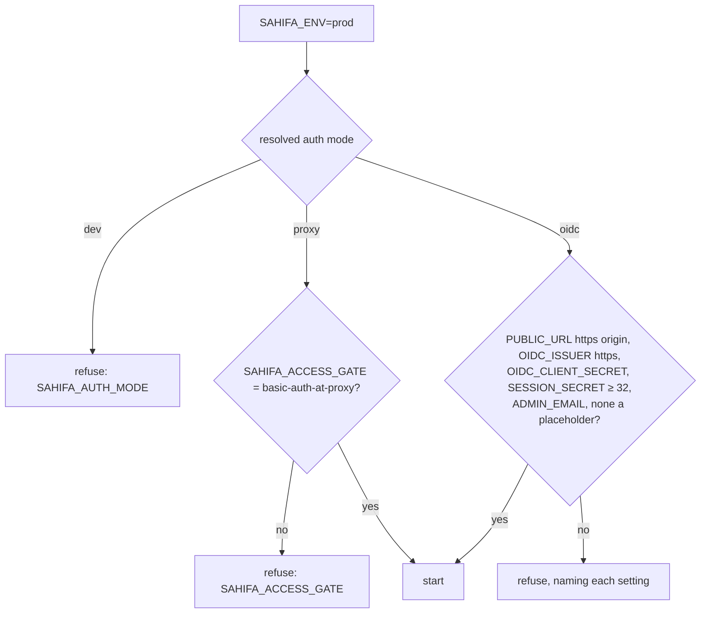
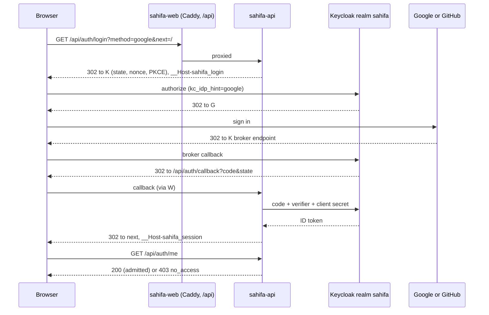

# Spec 006 — Sign-in through Keycloak (backend-for-frontend)

Sprint 2, story S2-0. Depends on: spec 004 (API, settings, `prod_problems`), spec 005 (web
app); ADR-0010. Template: Tabayyun spec 013 and its `tabayyun.auth` package. Packages: `api/`
(new `sahifa.auth`, `routers/auth.py`, settings, migration 0002), `web/` (session check, login,
no access, account, sign-out), `deploy/` (CapRover, `.env.example`, one-click template).

Status: done 2026-10-02 (PRs #2, #3); pulled forward from R2 (sprint 4) on 2026-10-02 so that staging can drop the shared
basic-auth password. Organisations, workspaces, memberships and row-level security stay in
sprint 4; this spec only answers "who is this, and may they come in".

## Goal

A person opens Sahifa and signs in with Google, GitHub or a passkey through the `sahifa` realm
in Keycloak. The API runs the OIDC Authorization Code flow with PKCE and keeps every token
server-side; the browser gets only an opaque `__Host-sahifa_session` cookie.

- **Who gets in:** only people whose verified email is `SAHIFA_ADMIN_EMAIL` or one of
  `SAHIFA_ALLOWED_EMAILS`. Everyone else who signs in sees "No access yet", and the API answers
  them 403 `no_access`.
- **Requests:** every `/api/connections` and `/api/scans` request acts for the signed-in user.
  No valid session → 401. An unsafe request without the CSRF header → 403.
- **Sessions:** each records how it signed in (`google`, `github`, `passkey`). Users see their
  signed-in devices and can sign the others out. Idle timeout 12 h, absolute lifetime 30 days.
- **Logout:** ends the Sahifa session and the Keycloak session. Keycloak's back-channel logout
  ends Sahifa sessions too.
- **Without Keycloak:** `dev` (local) and `proxy` (behind HTTP basic auth, today's staging) keep
  working as before, with no login page.

## User story

As a data owner, I sign in with my Google or GitHub account or a passkey so that only the
people I admit see our connections, scans and findings, and I never have a Sahifa password.

## Interface

### Settings (environment variables, `SAHIFA_` prefix)

| Name | Default | Meaning |
|---|---|---|
| `SAHIFA_AUTH_MODE` | see below | `oidc`: sessions required. `dev`: every request acts as the local developer; refused in `prod`. `proxy`: every request acts as one "proxy" principal, for installs behind HTTP basic auth |
| `SAHIFA_PUBLIC_URL` | — | External origin, e.g. `https://sahifa-stg.siralabs.org`; the redirect URI, the post-logout URI and the `Origin` check derive from it |
| `SAHIFA_OIDC_ISSUER` | — | e.g. `https://miftachun.apps.data-and-ai-dude.ch/realms/sahifa`; discovery at `/.well-known/openid-configuration` |
| `SAHIFA_OIDC_CLIENT_ID` | `sahifa-api` | Confidential client in the realm |
| `SAHIFA_OIDC_CLIENT_SECRET` | — | Its secret |
| `SAHIFA_SESSION_SECRET` | — | Key of the HMAC under which session and login-flow tokens are stored; at least 32 characters |
| `SAHIFA_ADMIN_EMAIL` | — | The one address that always gets access, shown as administrator |
| `SAHIFA_ALLOWED_EMAILS` | empty | Further addresses with access, comma-separated, case-insensitive |
| `SAHIFA_SIGN_IN_METHODS` | `google,github,passkey` | Buttons the login page shows; each must also be set up in the realm |
| `SAHIFA_SESSION_IDLE` | `12h` | Idle timeout (`30m`, `12h`, `30d` or an ISO duration) |
| `SAHIFA_SESSION_ABSOLUTE` | `30d` | Absolute lifetime of a session |

**Resolved auth mode.** `SAHIFA_AUTH_MODE` when set. Unset: `dev` outside `prod`; in `prod`,
`proxy` when `SAHIFA_ACCESS_GATE=basic-auth-at-proxy` is set (so installs from before this spec,
such as today's staging, keep starting unchanged), else `oidc`.

**Production check (`prod_problems`).** In `prod` the API starts only when one of two ways keeps
strangers out:

- **Sign-in:** the OIDC settings are complete and not placeholders. The client secret needs
  16 characters at least; the session secret 32.
- **Basic auth at the proxy:** `SAHIFA_ACCESS_GATE=basic-auth-at-proxy` with the mode `proxy`
  (explicit, or resolved as above). `proxy` without the gate is refused.
- When the mode resolved to `oidc` by default and settings are missing, the refusal also names
  `SAHIFA_ACCESS_GATE` as the alternative.
- Outside `prod`, `oidc` with a missing setting stops the start too, naming it.

### Routes (all under `/api/auth`, none behind `current_user`)

| Route | Request | Response |
|---|---|---|
| `GET /api/auth/options` | — | `{"mode": "oidc", "methods": ["google", "github", "passkey"], "account_url": "<issuer>/account"}`; in `dev` and `proxy`: `{"mode": "dev", "methods": [], "account_url": null}` |
| `GET /api/auth/login?method=google&next=/scans/new` | `method` ∈ enabled methods; `next` a relative path, default `/` | 302 to the IdP's authorization endpoint (`response_type=code`, `scope=openid email profile`, `state`, `nonce`, `code_challenge` S256). Every method adds `prompt=login` (an existing Keycloak SSO session from another method cannot answer); `google`/`github` add `kc_idp_hint`. Sets `__Host-sahifa_login` (flow token, 10 min). Unknown or disabled method → 400 `unknown_method`; IdP unreachable → 503 `idp_unavailable`; not in `oidc` → 404 |
| `GET /api/auth/passkey/add` | cookie | 302 to the IdP like `login` with the session's method, plus `kc_action=webauthn-register-passwordless` and `login_hint=<email>`: a fresh sign-in, then Keycloak's passkey registration; `next` is `/settings/account`. 401 without a session; 404 outside `oidc` |
| `GET /api/auth/callback?code&state[&kc_action_status]` | from the IdP | 302 to `next`; sets `__Host-sahifa_session` and revokes the browser's previous session in the same transaction; clears `__Host-sahifa_login`. A `kc_action_status` of `success`, `cancelled` or `error` is passed on as `?passkey=<status>`; with one, the signed-in user must be the browser's current one (else 409 `account_mismatch`, nothing changes). Failures are short HTML pages (behaviour 3) |
| `GET /api/auth/me` | cookie | 200 `{"mode", "user": {"id", "email", "display_name"}, "sign_in_method", "admin"}`; 401 `not_authenticated`; 403 `{"detail": "no_access", "email", "message"}`. In `dev`/`proxy`: the fixed principal, `sign_in_method` `dev`/`proxy`, `id` and `email` null |
| `GET /api/auth/sessions` | cookie | `[{"id", "current", "sign_in_method", "created_at", "last_seen_at", "user_agent", "ip_address"}]`, never tokens; `[]` in `dev`/`proxy` |
| `DELETE /api/auth/sessions/{id}` | CSRF header | 204; only the user's own sessions (404 otherwise); the current one also clears the cookie |
| `POST /api/auth/sessions/revoke-others` | CSRF header | 204; revokes every other session of the user |
| `POST /api/auth/logout` | CSRF header | 200 `{"logout_url": "<end_session URL with id_token_hint and post_logout_redirect_uri>"}`, or `"/"` without an IdP; clears the cookie |
| `POST /api/auth/backchannel-logout` | form `logout_token` | 200; 400 `invalid_token`; exempt from the CSRF header, authenticated by the token's signature; 404 outside `oidc` |

Public besides `/api/auth/*`: `/healthz` and `/api/version`. Every route of `/api/connections`
and `/api/scans` depends on `current_user`.

Cookies: `__Host-sahifa_session` and `__Host-sahifa_login` are `HttpOnly; Secure;
SameSite=Lax; Path=/`. Their values are random 32-byte tokens (base64url); only
HMAC-SHA256(`SAHIFA_SESSION_SECRET`, token) is stored. The session cookie's `Max-Age` is the
absolute lifetime.

CSRF: every `POST`, `PUT`, `PATCH`, `DELETE` carries `X-Sahifa-Request: 1`.

### Database (migration 0002)

| Table | Columns |
|---|---|
| `users` | `id` uuid PK, `email` text unique (lower case, `ck_users_email_lower`), `display_name` text, `issuer` text, `subject` text, unique (`issuer`, `subject`), `created_at`, `last_login_at` |
| `sessions` | `id` uuid PK (what devices name), `id_hash` bytea unique, `user_id` → users (cascade), `sign_in_method` CHECK (`google`, `github`, `passkey`), `idp_sid` text, `id_token` text, `ip_address` inet, `user_agent` text, `created_at`, `last_seen_at`, `expires_at`, `revoked_at`; indexes on `user_id` and `idp_sid` |
| `login_flows` | `id_hash` bytea PK, `state`, `nonce`, `code_verifier`, `method`, `next`, `created_at` |

Access is not a column: it is computed from the settings at each request, so changing
`SAHIFA_ALLOWED_EMAILS` takes effect at the next restart, for existing sessions too.

### Keycloak (`deploy/keycloak/sahifa-realm.json`, exists)

Realm `sahifa`; confidential client `sahifa-api` (standard flow, PKCE S256), redirect URI
`<public>/api/auth/callback`, post-logout redirect `<public>/`, back-channel logout URL
`<public>/api/auth/backchannel-logout`; mappers `identity_provider` and `amr`; Google and
GitHub brokers trusting email; passkeys as WebAuthn passwordless with the AMR reference
`passkey`; no password credential. As in Tabayyun spec 013, "Keycloak". Set-up steps:
`deploy/caprover.md`, section 4a.

### Web

- **Session check:** the app layout calls `/api/auth/me` before rendering a page.
  - 401 → `/login?next=<current path>`; any later 401 from an API call does the same.
  - 403 `no_access` → the "No access yet" page naming the email, with a sign-out button.
  - `dev` and `proxy` → the app as before: no login page, no account link, no sign-out.
- **`/login`:** one button per method from `/api/auth/options` ("Continue with Google",
  "Continue with GitHub", "Sign in with a passkey"), each a link to
  `/api/auth/login?method=…&next=…`.
- **Header (oidc):** "Account" link, the user's name, "Sign out" (`POST /api/auth/logout`,
  then `window.location = logout_url`).
- **Settings → Account (`/settings/account`):** who is signed in and how; signed-in devices
  with "Sign out" per device and "Sign out all other devices"; "Add a passkey" (to
  `/api/auth/passkey/add`) with the outcome from `?passkey=`, and "Manage passkeys" linking to
  `account_url` (`<issuer>/account`, Keycloak's account console) to rename or remove them.
- Every request carries `X-Sahifa-Request: 1`. The visual language is the existing one
  (tokens and components of `web/src/index.css`).

## Behaviour

1. **Startup.** The mode resolves as above; `prod_problems` refuses the start as above. With
   `oidc` the API fetches the discovery document lazily at the first sign-in and caches it for
   1 h with the JWKS; an unknown key id refetches the JWKS at most once a minute. When the IdP
   is unreachable the sign-in routes answer 503 and nothing else is affected. In `proxy` mode
   with `SAHIFA_OIDC_ISSUER` set, the start logs a warning (`auth.mode`).
2. **Login start.** `next` must be a path starting with one `/`, without a scheme, host,
   backslash or control character; anything else becomes `/` (no open redirect). The API
   stores the flow (state, nonce, PKCE verifier, method, next), sets `__Host-sahifa_login`,
   and answers 302.
3. **Callback.**
   - **Flow match:** the login cookie must match a flow younger than 10 minutes whose `state`
     equals the query's; else 400 `login_expired`. The flow is deleted either way (single use).
     `error=access_denied` from the IdP → 400 `login_cancelled`, another error → 400
     `idp_error`.
   - **Code exchange** with the client secret and the verifier. An IdP refusal → 502
     `idp_error`, logged with the IdP's `error` code only; unreachable → 503 `idp_unavailable`.
   - **ID token:** signature (JWKS, RS256/ES256 only, so `alg=none` fails), `iss`, `aud` (and
     `azp` with several audiences), `exp` with 60 s leeway, `iat`, `sub`, `nonce`, and
     `email_verified = true` with a non-empty email. Any failure → 400 `invalid_token`.
   - **Sign-in method:** `passkey` needs `passkey` in `amr` (else 400 `passkey_required`);
     `google`/`github` need `identity_provider` equal to the method (else 400 `invalid_token`).
     Only the claim of the requested method counts (Tabayyun's stale-claim finding).
   - **User:** under an advisory lock, found by (issuer, `sub`); else linked by the lower-cased
     email (a new identity of a known person); else created. When a known identity arrives
     with an email another user holds → 409 `account_conflict`.
   - **Session:** a new one at every sign-in (rotation) with the method, `sid`, the ID token
     (for the logout hint), IP (`X-Real-IP` behind the proxy, else the peer) and user agent;
     the user's dead sessions are pruned. 302 to `next` with the cookie. People without
     access get a session too, so `/me` can name them.
   - Failures answer with a short HTML page naming the code and linking to `/login`; no
     session is created.
4. **Every protected request** (`/api/connections`, `/api/scans`):
   - the cookie is looked up by HMAC; missing, unknown, revoked, idle longer than
     `SESSION_IDLE` or past `expires_at` → 401 `{"detail": "not_authenticated"}`;
   - `last_seen_at` is updated at most once a minute;
   - the session's email must be `SAHIFA_ADMIN_EMAIL` or in `SAHIFA_ALLOWED_EMAILS`
     (case-insensitive), else 403 `{"detail": "no_access", "email": …, "message": "You are
     signed in as …, but this address has no access to this Sahifa yet. Ask its administrator
     to add it to SAHIFA_ALLOWED_EMAILS."}`;
   - in `dev` and `proxy` the request acts as the fixed principal, without a cookie.
5. **`/api/auth/me`** answers as in the table; it applies the same access rule. Devices and
   logout stay reachable without access, so a person without access can sign out.
6. **CSRF**, for every unsafe method except the back-channel logout, in every mode: the
   `X-Sahifa-Request: 1` header is required, and an `Origin` header, when present, must equal
   `SAHIFA_PUBLIC_URL`'s origin; else 403 `{"detail": "csrf"}`. Stricter than SameSite alone
   because the API takes multipart uploads.
7. **Devices:** users list and revoke only their own sessions. Revoking the current one
   clears its cookie.
8. **Logout:** revokes the session, clears the cookie and returns the IdP's end-session URL
   with `id_token_hint` and `post_logout_redirect_uri=<public>/`. Without a session it still
   answers 200 with the plain end-session URL; with the IdP down, `/`.
9. **Back-channel logout:** the `logout_token` must pass signature, `iss`, `aud`, `iat`, carry
   the back-channel event claim and no `nonce`, and name a `sid` or `sub`. Every session with
   that `sid` (or, without one, every session of the identity `sub`) is revoked.
10. **Logging:** `auth.login` (user id, method, access), `auth.denied` (reason: `no_access`,
    `login_expired`, `invalid_token`, `passkey_required`, `idp_error`, `csrf_header`,
    `csrf_origin`, `email_taken`, `account_mismatch`, `invalid_logout_token`), `auth.action` (user id, status), `auth.idp_unavailable` (URL, error
    type), `auth.logout`, `auth.session_revoked` (reason, count). Never tokens, codes, cookie
    values or secrets.

## Acceptance criteria

- [x] With a mocked IdP (discovery, JWKS, token endpoint), the full code+PKCE flow sets a
      session cookie for `google`, `github` and `passkey`; `/api/auth/me` returns the user and
      the method; `/api/scans` and `/api/connections` answer 200.
- [x] State mismatch, a reused flow, an expired flow, a cancelled sign-in, an unknown code, a
      wrong nonce, a wrong audience, a bad signature, `alg=none`, `email_verified=false`, a
      passkey flow without `passkey` in `amr` and a Google flow returning through GitHub each
      fail with the stated status, and no session is created.
- [x] `next=https://evil.example`, `//evil.example` and `/\evil.example` redirect to `/`; a
      disabled method gives 400.
- [x] An address that is neither the admin email nor allowed gets a session and 403
      `no_access` (with the email and a message) from `/me` and from `/api/scans`; an allowed
      address gets in without `admin`; widening `SAHIFA_ALLOWED_EMAILS` admits it.
- [x] Unknown, revoked, idle-expired and absolute-expired sessions each give 401; the
      absolute lifetime sets `expires_at` and the cookie's `Max-Age`.
- [x] `GET /api/auth/sessions` lists only the user's sessions without tokens; deleting another
      user's session gives 404; `revoke-others` keeps only the current one.
- [x] Unsafe requests without `X-Sahifa-Request` or with a foreign `Origin` give 403; the
      back-channel logout is exempt.
- [x] Logout revokes the session and returns an end-session URL with `id_token_hint`; a
      back-channel logout token revokes by `sid` and by `sub`; an invalid one gives 400.
- [x] `prod` refuses `AUTH_MODE=dev`, `proxy` without the access gate, and missing or
      placeholder OIDC settings (each named); it accepts the full OIDC settings, and the
      access gate without OIDC settings (today's staging).
- [x] `dev` and `proxy`: `/me` is the fixed principal, `/login` 404, options without methods,
      the protected routes answer without a cookie. Existing API tests keep passing.
- [x] `alembic check` passes after migration 0002.
- [x] The web app shows the configured sign-in buttons, sends a signed-out user to `/login`
      with `next`, shows "No access yet" for 403, lists and revokes devices, signs out through
      the IdP, and in dev mode shows no login, account link or sign-out.
- [x] Staging: the owner signs in with Google, with GitHub and with a passkey on
      `sahifa-stg.siralabs.org`, sees the device list and signs out; an anonymous `curl` of
      `/api/scans` gives 401 (after switching staging from basic auth to `oidc`).
      Evidence (2026-10-02): the owner confirmed all three sign-ins in the session; against
      commit 9ac52b4, `GET /api/auth/options` answered `{"mode":"oidc","methods":["google","github","passkey"],…}`,
      anonymous `GET /api/scans`, `GET /api/auth/me` and `GET /api/auth/passkey/add` answered 401, and
      `GET /api/auth/login?method=github` redirected through realm `sahifa` to GitHub with the real client ID.

## Test cases

Unit (`api/tests/auth`, ported from Tabayyun):
- `test_tokens.py`: `test_next_param_is_relative_only`, `test_session_hmac_lookup`,
  `test_pkce_challenge_matches_rfc_7636`.
- `test_csrf.py`: `test_csrf_header_and_origin`, `test_safe_methods_and_exempt_path_pass`.
- `test_oidc.py` against the in-process fake IdP (`api/tests/fake_idp.py`):
  `test_valid_id_token`, `test_id_token_validation` (parametrised over each failure),
  `test_expiry_has_leeway`, `test_key_rotation_refetches_the_jwks_once`,
  `test_discovery_must_name_its_issuer`, `test_authorization_url_per_method`,
  `test_code_exchange_checks_the_verifier`, `test_logout_token_validation`,
  `test_end_session_url`, `test_sign_in_method_from_claims`.

Settings (`api/tests/test_settings.py`): `test_auth_mode_defaults`, `test_prod_oidc_ok`,
`test_prod_refuses_dev_mode`, `test_prod_proxy_needs_the_gate`,
`test_prod_oidc_refuses_missing_or_placeholder` (parametrised),
`test_prod_default_oidc_names_the_basic_auth_alternative`,
`test_access_follows_admin_and_allowed_emails`, `test_durations_and_methods`; the existing
access-gate tests unchanged.

Integration (`api/tests/test_auth_flow.py`, `SAHIFA_TEST_DATABASE_URL`, fake IdP):
`test_full_login_per_method`, `test_anonymous_requests`, `test_callback_rejects_tokens`,
`test_login_flow_is_single_use`, `test_next_and_methods`, `test_unknown_email_gets_no_access`,
`test_identity_links_by_email`, `test_idle_and_absolute_expiry`,
`test_session_lifetimes_follow_the_settings`, `test_devices_list_and_revoke`,
`test_logout_revokes_and_returns_end_session`, `test_backchannel_logout_revokes_by_sid`,
`test_csrf_on_the_app`, `test_idp_unavailable_only_affects_login`,
`test_dev_and_proxy_modes_have_no_login`, `test_session_older_than_a_minute_is_touched`.

Web (`web/src/__tests__`):
- `Login.test.tsx`: buttons follow the options; `next` is kept or dropped; 401 redirects to
  `/login` with `next`; dev mode explains itself and needs no login; unknown paths still show
  the not-found page in the frame.
- `NoAccess.test.tsx`: the 403 page with the email, sign-out with the CSRF header.
- `SignOut.test.tsx`: logout, then navigation to `logout_url`; no sign-out in proxy mode.
- `Devices.test.tsx`: list, passkeys link, "Add a passkey" and its outcome, revoke one, revoke others, revoke this device;
  nothing to manage without sign-in.

## Decisions

1. **Access by email list, not memberships.** Sahifa has no orgs yet; the admin email plus an
   allow-list is the smallest rule that keeps an install private. It is computed per request,
   so removing an address takes effect at the next restart without touching the database.
   Sprint 4 replaces it with memberships and invitations (ADR-0010).
2. **No SECURITY DEFINER login function.** Tabayyun writes users only through
   `tabayyun_login()` because its app login cannot write `users` under RLS. Sahifa has one
   database login and no RLS yet, so the store writes users directly, serialised by an
   advisory lock as Tabayyun does.
3. **One identity per user.** `users` holds the realm identity (issuer, subject) directly.
   Keycloak links Google and GitHub to one realm user, so one `sub` covers both; a new `sub`
   with a known verified email re-links the user. A separate identities table arrives with
   enterprise SSO if needed.
4. **`proxy` as a third mode.** Staging runs behind CapRover's basic auth without OIDC
   settings. Rather than refusing it, `prod` accepts the gate with `proxy`, and an unset mode
   resolves to `proxy` when the gate is declared, so the running install and the one-click
   template keep starting. The template sets `SAHIFA_AUTH_MODE=proxy` explicitly.
5. **No passkey freshness gate.** Tabayyun's `require_recent_passkey()` guards admin routes;
   Sahifa has no admin routes yet. The session already records the method, so the gate can
   be added when they arrive.
6. **joserfc and httpx**, as in Tabayyun (Authlib deprecates its own JOSE module); both are
   BSD-licensed (ADR-0008).
7. **Adding a passkey starts in Sahifa** (changed 2026-10-02 after the staging check). The
   first version only linked to Keycloak's account console. Keycloak asks for a recent
   sign-in before it adds a credential, and in this realm that re-authentication offers only a
   passkey, which a first-time user has not got, so the owner could not add one. "Add a
   passkey" now runs the registration as an application-initiated action (`kc_action`) after a
   fresh sign-in with the session's own method (`prompt=login` plus `kc_idp_hint`), with
   `login_hint` preselecting the account. If that sign-in returns as another user, the
   callback refuses it (409 `account_mismatch`) so the browser is not switched; the passkey
   then belongs to the account that just authenticated, which that person controls.

## Out of scope

- Organisations, workspaces, memberships, roles, invitations, row-level security, the admin
  panel and the passkey gate for admin actions: sprint 4 (ADR-0010).
- Rate limits on the auth routes and the security-header pass: sprint 3, story S3-1.
- API tokens for scripts: R3 (sprint 12).
- Production Keycloak and its Google and GitHub OAuth apps: owner tasks (`TASKS.md`).
